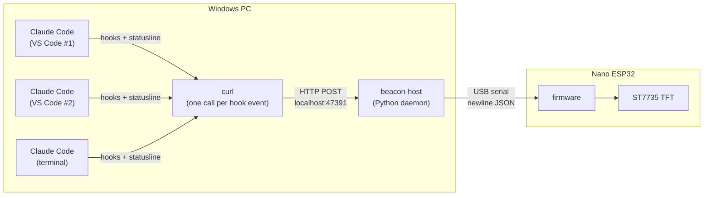

# Session Beacon

A small USB-attached status light for Claude Code. It shows, at a glance, every Claude Code session running on the machine, which ones are waiting on you, and a few coarse usage numbers, on a 1.8" colour TFT sitting next to the monitor.

The problem it solves: with three or four VS Code windows each running Claude Code, it is easy to leave one session blocked on a permission prompt for twenty minutes without noticing. Desktop notifications get lost or dismissed. A dedicated physical display does not.

---

## Hardware

| Part | Notes |
|------|-------|
| Arduino Nano ESP32 | ESP32-S3, native USB CDC serial, 3.3 V logic |
| 1.8" TFT, 128x160, ST7735S | SPI, 3.3 V, 8-pin header, [this JESSINIE listing](https://www.amazon.com/dp/B0D31BGJWF). Both panels bought from it were BGR-wired and need a one-line colour-order fix, without which red and blue render swapped. Verify yours; the check is free. |
| USB-C cable | Data + power, nothing else needed |
| Enclosure, 3 printed parts | 40 x 60 mm, 19 mm deep. 3MF in [`enclosure/`](enclosure) |
| 4x M2 x 12 hex-head screws + 4x M2 nuts | Through the stack |
| 26 AWG silicone hookup wire, tinned copper | Eight conductors. Silicone is the point: PVC jumper wire is too stiff and springs the case open |

Wiring is carried over from the `env_monitoring` firmware and needs no passives or level shifting: eight conductors, all 3.3 V. See [docs/hardware.md](docs/hardware.md) for the pinout and bring-up procedure, and [docs/enclosure.md](docs/enclosure.md) for the case and the full bill of materials.

---

## How it works



1. **Claude Code hooks** fire on session lifecycle events. Each one is a single `curl` call to the daemon, which measured about eight times cheaper than starting a Python interpreter per event.
2. **beacon-host** keeps a per-session state machine (starting / working / needs input / error / idle / stale / ended), enriches it with cost and context data from the statusline hook, and pushes a compact snapshot to the device whenever anything changes.
3. **Firmware** is deliberately dumb: it parses the snapshot and draws it. All policy lives on the host so it can change without reflashing.

On the screen, one row per session:

```
+----------------------------------------+
| BEACON      4 active         $61.17    |
|----------------------------------------|
||########## env_monitoring      14m ####|  filled red + pulsing: wants you now
| o session-beacon                2m     |  blue: working
| o factory-dynamics              6m     |  magenta: stopped on an API error
| o bench-metrology              15m     |  amber: busy but gone quiet
| o homelab                       7s     |  green: finished its turn
|                                        |
|----------------------------------------|
| ctx  73% [#######...]         opus5    |  <- 4s
| 5h   92% [#########.]      7d  28%     |  -> 4s
+----------------------------------------+
```

The bar down the far left of the top row marks the session the footer's context
page is describing. The footer alternates every four seconds between that session
and your account's rolling five-hour and seven-day usage.

State is carried by colour rather than a word, and the elapsed time is how long a
session has been in that state. The one that wants you fills its whole row and
pulses, which reads from across a desk in a way six-pixel text does not.

Details: [docs/architecture.md](docs/architecture.md), [docs/protocol.md](docs/protocol.md), [docs/claude-code-integration.md](docs/claude-code-integration.md).

---

## Status

**Working end to end on Windows.** Hooks feed the daemon, the daemon drives the
display, and the whole path has been exercised on real hardware.

Verified on the bench: wiring and panel colour order, firmware rendering and its
timers, the daemon and its state machine, hook delivery from live sessions,
session labelling, and hardware SPI at 24 MHz.

**One gap worth knowing about.** The events that drive the attention state,
`PermissionRequest` and the attention `Notification` types, have not been seen
firing yet. They are present in the Claude Code binary and the state machine
handles all the paths they could arrive by, but triggering one needs an
interactive permission prompt, which a scripted run cannot produce. Everything
around it is confirmed; that one signal is still reasoning rather than evidence.

The enclosure is printed and fitted, so it is a finished object rather than a
breadboard. Remaining work is comfort rather than function: see
[docs/roadmap.md](docs/roadmap.md).

---

## Repository layout

```
firmware/beacon/          Arduino sketch for the Nano ESP32 (Arduino IDE, Adafruit_ST7735)
firmware/tft_smoketest/   Standalone wiring/display test, flash this first
host/                     Python daemon: hook receiver, state, serial link
  src/beacon_host/
hooks/                    Example Claude Code settings, plus a payload capture tool
scripts/                  install-hooks.ps1, install-task.ps1, uninstall.ps1
enclosure/                3MF source for the three printed parts
docs/                     Architecture, hardware, enclosure, protocol, integration, roadmap
```

---

## Quick start

```powershell
# 0. Wire the display per docs/hardware.md, then flash firmware/tft_smoketest to check it

# 1. Flash the firmware
$cli = "$env:LOCALAPPDATA\Programs\Arduino IDE\resources\app\lib\backend\resources\arduino-cli.exe"
& $cli compile --fqbn arduino:esp32:nano_nora firmware/beacon
& $cli upload  --fqbn arduino:esp32:nano_nora -p COM4 firmware/beacon

# 2. Run the host
cd host; uv sync
uv run beacon-host --dry-run -v      # sanity check without the board
uv run beacon-host                   # auto-detects the board by USB id

# 3. Install the Claude Code hooks, then RESTART your Claude Code sessions.
#    Without this the daemon runs happily and reports zero sessions forever.
./scripts/install-hooks.ps1 -WithStatusLine   # omit the switch to keep your own status line
curl.exe -s http://127.0.0.1:47391/health   # events_received should climb

# 4. Optional: start the daemon automatically at logon
./scripts/install-task.ps1
```

To undo all of it, including the hooks, the scheduled task, the running daemon
and the logs:

```powershell
./scripts/uninstall.ps1 -WhatIf    # show what it would touch
./scripts/uninstall.ps1
```

Setup reaches outside this repository, so deleting the folder would leave a
Scheduled Task, hooks in your Claude Code settings and a daemon holding a COM
port behind. The uninstall script keeps anything it did not create: your own
hooks, your other settings, your config file, and a status line it replaced is
restored rather than dropped.

If the display says `no sessions`, the daemon and the wiring are fine and
Claude Code simply is not calling the hooks. Check `events_received` at
`/health`, then re-run `install-hooks.ps1` and restart your sessions.

If the footer says `no statusline data`, everything else is working but the
statusline hook is not installed. That hook is the only source of cost and
context figures. Re-run `install-hooks.ps1 -WithStatusLine` and restart your
sessions. If you already had a status line of your own, the installer saves it
and `uninstall.ps1` puts it back.
