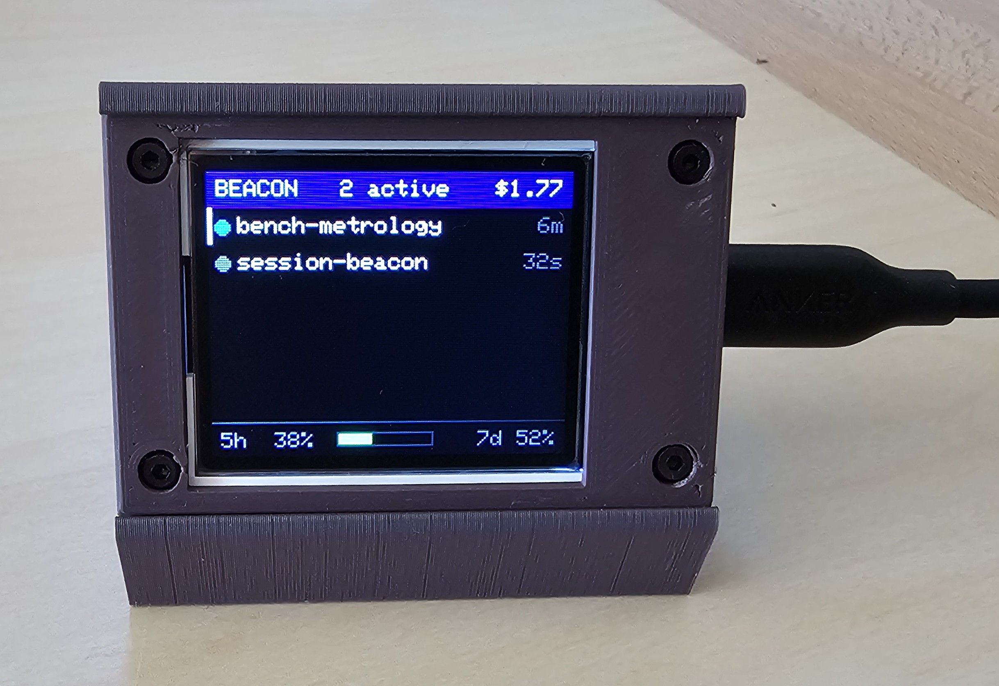
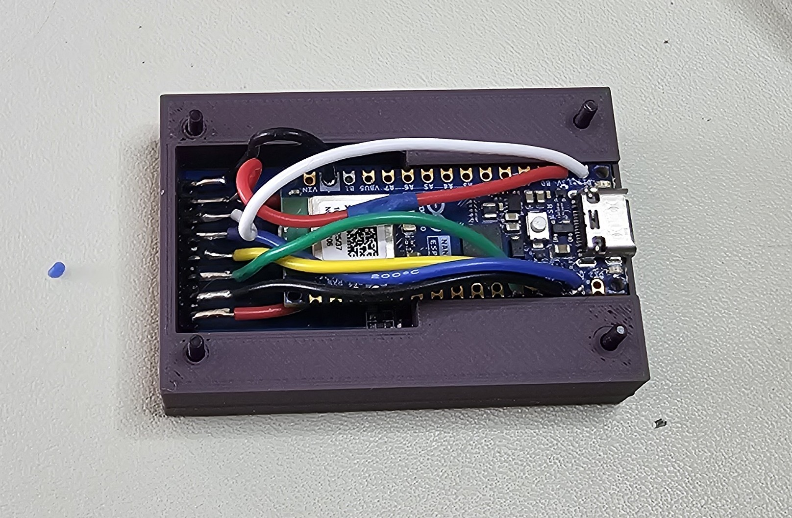
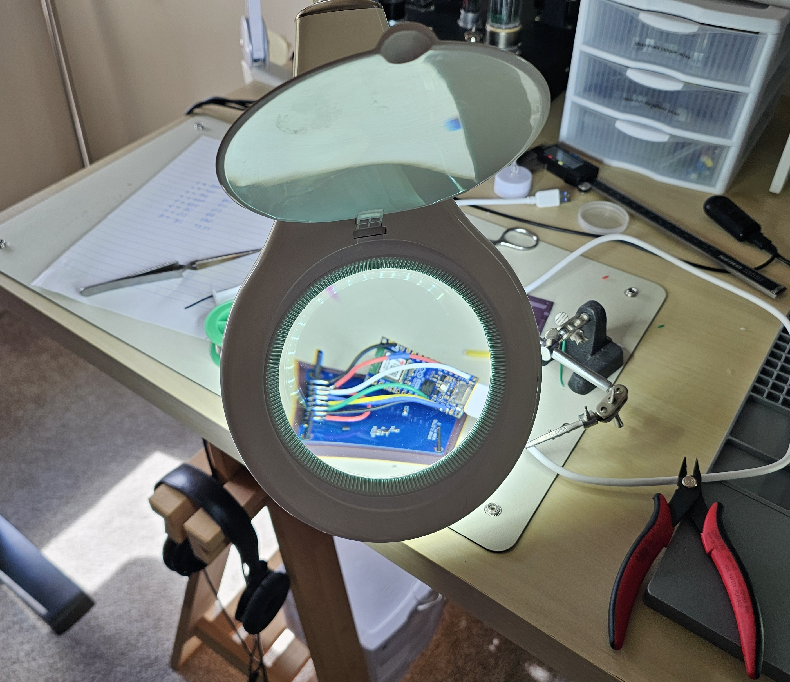
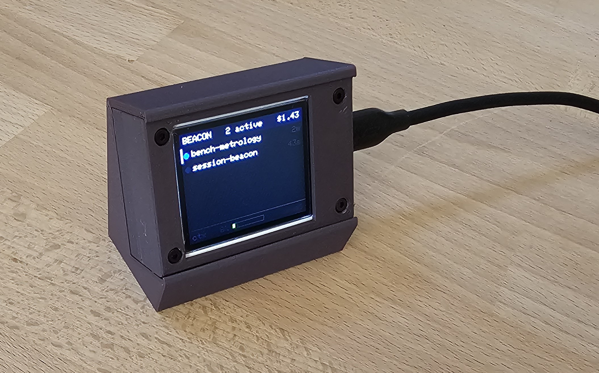
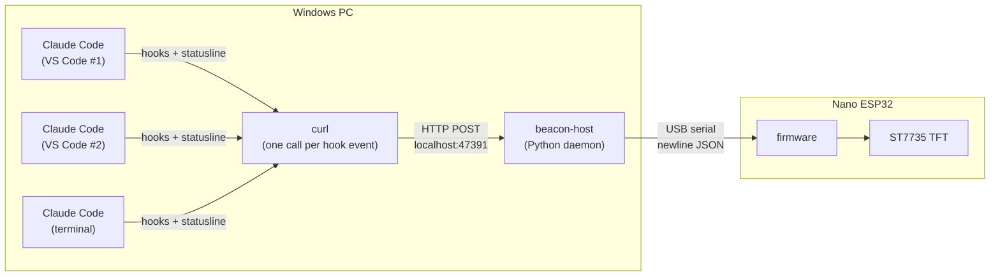

# Session Beacon

A small USB-attached status light for Claude Code. It shows, at a glance, every Claude Code session running on the machine, which ones are waiting on you, and a few coarse usage numbers, on a 1.8" colour TFT sitting next to the monitor.

The problem it solves: with three or four VS Code windows each running Claude Code, it is easy to leave one session blocked on a permission prompt for twenty minutes without noticing. Desktop notifications get lost or dismissed. A dedicated physical display does not.



Two sessions on screen, in the 25-degree desk stand. `bench-metrology` last changed
state six minutes ago, `session-beacon` thirty-two seconds ago. The bar down the left
of the top row marks the session the footer is describing. The header totals spend
across every live session; the footer is caught on its usage page, showing 38% of the
rolling five-hour limit and 52% of the seven-day one.

---

## Hardware

| Part | Notes |
|------|-------|
| Arduino Nano ESP32, **headerless** | ABX00092, not the headered ABX00083. ESP32-S3, native USB CDC, 3.3 V logic. Overkill for this: Wi-Fi is never used, and an RP2040-Zero would be cheaper if you redesign the case |
| 1.8" TFT, 128x160, ST7735S | SPI, 3.3 V, 8-pin header, [this JESSINIE listing](https://www.amazon.com/dp/B0D31BGJWF). Both panels bought from it were BGR-wired and need a one-line colour-order fix, without which red and blue render swapped. Verify yours; the check is free. |
| USB-C cable | Data + power, nothing else needed |
| Enclosure, 3 printed parts | 40 x 60 mm, 19 mm deep. SolidWorks, STEP and 3MF in [`enclosure/`](enclosure) |
| Desk stand, 1 printed part, optional | Tilts the screen back 25 degrees. The case is a friction fit in the slot, so nothing fastens it |
| 4x M2 x 16 socket-head screws + 4x M2 nuts | Head and nut both counter-sunk into the 19 mm stack. Length excludes the head, per the machine screw convention |
| 26 AWG silicone hookup wire, tinned copper | Eight conductors, soldered direct to the display's bent-over header. Silicone is required, not preferred: PVC is stiff enough to lift the board out of its retaining ridges |

Wiring is carried over from the `env_monitoring` firmware and needs no passives or
level shifting: eight conductors, all 3.3 V. See
[docs/hardware.md](docs/hardware.md) for the pinout and bring-up procedure, and
[docs/enclosure.md](docs/enclosure.md) for the case and the full bill of materials.



The open case shows why three items in that list are requirements rather than
preferences. The Arduino is the headerless board, so its pads are bare and the printed
ridges can close directly onto the PCB to retain it. The display's eight-pin header is
bent flat against the board with wires soldered straight to it, because a socket would
not fit under the lid. And the wire is silicone: one jacket is printed `200 C`, which is
the rating that stops it shrinking back from the iron on leads this short.



Soldering the bent header. Eight joints on 2.54 mm pitch, done under a magnifier lamp.



The stand seen from off-axis. Flat on the desk the screen points at the ceiling; 25
degrees back is what makes it readable from a seated position. The case is a friction
fit in the slot, so the stand is genuinely optional and nothing about the case depends
on it.

---

## How it works



1. **Claude Code hooks** fire on session lifecycle events. Each one is a single `curl` call to the daemon, which measured about eight times cheaper than starting a Python interpreter per event.
2. **beacon-host** keeps a per-session state machine (starting / working / needs input / error / idle / stale / ended), enriches it with cost and context data from the statusline hook, and pushes a compact snapshot to the device whenever anything changes.
3. **Firmware** is deliberately dumb: it parses the snapshot and draws it. All policy lives on the host so it can change without reflashing.

On the screen, one row per session:

```
+----------------------------------------+
| BEACON      4 active         $61.17    |
|----------------------------------------|
|############ env_monitoring     14m ####|  wants you now: filled red, pulsing
| o session-beacon                 2m    |  blue: working
| o data-pipeline                  6m    |  magenta: stopped on an API error
| o web-frontend                  15m    |  amber: busy but gone quiet
| o homelab                        7s    |  green: finished its turn
|                                        |
|----------------------------------------|
| ctx  73% [#######...]         opus5    |  <- 4s
| 5h   92% [#########.]      7d  28%     |  -> 4s
+----------------------------------------+
```

The bar down the far left of the top row marks the session the footer's context
page is describing. The footer alternates every four seconds between that session
and your account's rolling five-hour and seven-day usage.

State is carried by colour rather than a word, and the elapsed time is how long a
session has been in that state. The one that wants you fills its whole row and
pulses, which reads from across a desk in a way six-pixel text does not.

Details: [docs/architecture.md](docs/architecture.md), [docs/protocol.md](docs/protocol.md), [docs/claude-code-integration.md](docs/claude-code-integration.md).

---

## Status

**Working end to end on Windows.** Hooks feed the daemon, the daemon drives the
display, and the whole path has been exercised on real hardware.

Verified on the bench: wiring and panel colour order, firmware rendering and its
timers, the daemon and its state machine, hook delivery from live sessions,
session labelling, and hardware SPI at 24 MHz.

**One gap worth knowing about.** The events that drive the attention state,
`PermissionRequest` and the attention `Notification` types, have not been seen
firing yet. They are present in the Claude Code binary and the state machine
handles all the paths they could arrive by, but triggering one needs an
interactive permission prompt, which a scripted run cannot produce. Everything
around it is confirmed; that one signal is still reasoning rather than evidence.

The enclosure is printed and fitted, so it is a finished object rather than a
breadboard. Remaining work is comfort rather than function: see
[docs/roadmap.md](docs/roadmap.md).

---

## Contributing and licence

Three licences, one per kind of work, all permissive. Full texts in
[`LICENSES/`](LICENSES), and [LICENSE](LICENSE) maps them to paths.

| What | Licence |
|------|---------|
| Software and firmware | MIT |
| Enclosure design files | CERN-OHL-P-2.0 |
| Documentation and photos | CC BY 4.0 |

Code samples inside the documentation are MIT, not CC BY, so you can copy a pin
definition or a shell command without attributing anything. Every dependency is
BSD or MIT, so nothing here constrains what you do with it.

**Interest in an RP2040 port is welcome.** The Nano ESP32 is overkill for this: its
Wi-Fi and Bluetooth are most of what you pay for and the project uses neither, by
design. A Waveshare RP2040-Zero would be cheaper and smaller. If there is enough
interest, I am willing to test that board and design a dedicated enclosure for it.
Say so in an issue. The case is published as STEP as well as mesh, so a redesign does
not depend on owning SolidWorks or on waiting for me. What a port involves is written up in
[docs/enclosure.md](docs/enclosure.md#if-you-were-starting-from-scratch).

## Repository layout

```
firmware/beacon/          Arduino sketch for the Nano ESP32 (Arduino IDE, Adafruit_ST7735)
firmware/tft_smoketest/   Standalone wiring/display test, flash this first
host/                     Python daemon: hook receiver, state, serial link
  src/beacon_host/
hooks/                    Example Claude Code settings, plus a payload capture tool
scripts/                  install-hooks.ps1, install-task.ps1, uninstall.ps1
enclosure/                Three printed parts plus an optional stand: SolidWorks source, STEP, and 3MF
photos/                   Build and finished-device photos
docs/                     Architecture, hardware, enclosure, protocol, integration, roadmap
```

---

## Quick start

Every path below is relative to the **repository root**. The daemon runs in the
foreground and never exits on its own, so it needs a terminal of its own.

### 1. Build the device

Wire the display per [docs/hardware.md](docs/hardware.md), then flash
`firmware/tft_smoketest` and work through the bring-up checks before going near
the real firmware. When the colours and geometry look right:

```powershell
$cli = "$env:LOCALAPPDATA\Programs\Arduino IDE\resources\app\lib\backend\resources\arduino-cli.exe"
& $cli compile --fqbn arduino:esp32:nano_nora firmware/beacon
& $cli upload  --fqbn arduino:esp32:nano_nora -p COM4 firmware/beacon
& $cli board list    # if COM4 is wrong
```

The display should now read `no host`, which is correct: nothing is talking to
it yet.

### 2. Install the host software

```powershell
cd host
uv sync
uv run pytest                        # 38 tests, no hardware needed
uv run beacon-host --dry-run -v      # prints snapshots, Ctrl-C to stop
cd ..
```

### 3. Terminal 1: start the daemon and leave it running

```powershell
cd host
uv run beacon-host                   # finds the board by USB id; blocks until Ctrl-C
```

The display should switch from `no host` to `no sessions`. That is the daemon
talking to the device with nothing yet to report.

**Leave this running.** Everything below happens in a second terminal.

### 4. Terminal 2: install the hooks

```powershell
cd C:\path\to\session-beacon        # repository root, not host/
./scripts/install-hooks.ps1 -WithStatusLine
```

Omit `-WithStatusLine` to keep a status line you already have, at the cost of
the cost and context figures, which arrive only through that hook.

**Now restart your Claude Code sessions.** Hooks are read when a session starts,
so nothing reaches the daemon until you do. This is the step people miss.

```powershell
curl.exe -s http://127.0.0.1:47391/health
```

`events_received` should climb as you use Claude Code, and the display should
show a row per session.

### 5. Optional: survive a reboot

The daemon in Terminal 1 dies when you close that window. To have it start at
logon instead, with no console:

```powershell
./scripts/install-task.ps1           # from the repository root
Start-ScheduledTask -TaskName SessionBeacon
```

To undo all of it, including the hooks, the scheduled task, the running daemon
and the logs:

```powershell
./scripts/uninstall.ps1 -WhatIf    # show what it would touch
./scripts/uninstall.ps1
```

Setup reaches outside this repository, so deleting the folder would leave a
Scheduled Task, hooks in your Claude Code settings and a daemon holding a COM
port behind. The uninstall script keeps anything it did not create: your own
hooks, your other settings, your config file, and a status line it replaced is
restored rather than dropped.

If the display says `no sessions`, the daemon and the wiring are fine and
Claude Code simply is not calling the hooks. Check `events_received` at
`/health`, then re-run `install-hooks.ps1` and restart your sessions.

If the footer says `no statusline data`, everything else is working but the
statusline hook is not installed. That hook is the only source of cost and
context figures. Re-run `install-hooks.ps1 -WithStatusLine` and restart your
sessions. If you already had a status line of your own, the installer saves it
and `uninstall.ps1` puts it back.
