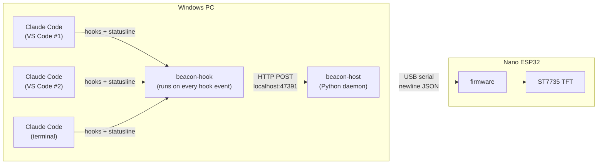

# Session Beacon

A small USB-attached status light for Claude Code. It shows, at a glance, every Claude Code session running on the machine, which ones are waiting on you, and a few coarse usage numbers, on a 1.8" colour TFT sitting next to the monitor.

The problem it solves: with three or four VS Code windows each running Claude Code, it is easy to leave one session blocked on a permission prompt for twenty minutes without noticing. Desktop notifications get lost or dismissed. A dedicated physical display does not.

---

## Hardware

| Part | Notes |
|------|-------|
| Arduino Nano ESP32 | ESP32-S3, native USB CDC serial, 3.3 V logic |
| 1.8" TFT, 128x160, ST7735 | SPI, 3.3 V, 8-pin header (same [JESSINIE module](https://www.amazon.com/dp/B0D31BGJWF) used in `env_monitoring`) |
| USB-C cable | Data + power, nothing else needed |

Wiring and display init are carried over from the `env_monitoring` firmware. See [docs/hardware.md](docs/hardware.md).

---

## How it works



1. **Claude Code hooks** fire on session lifecycle events (start, prompt submitted, tool use, notification, stop, end). A tiny hook script forwards each event to the daemon.
2. **beacon-host** keeps a per-session state machine (working / needs input / idle / ended), enriches it with cost and context data from the statusline hook, and pushes a compact snapshot to the device whenever anything changes.
3. **Firmware** is deliberately dumb: it parses the snapshot and draws it. All policy lives on the host so it can change without reflashing.

Details: [docs/architecture.md](docs/architecture.md), [docs/protocol.md](docs/protocol.md), [docs/claude-code-integration.md](docs/claude-code-integration.md).

---

## Status

Scoping and skeleton only. Nothing has been flashed or run yet. See [docs/roadmap.md](docs/roadmap.md) for the phased plan; Phase 1 is the first thing to build.

---

## Repository layout

```
firmware/beacon/          Arduino sketch for the Nano ESP32 (Arduino IDE, Adafruit_ST7735)
host/                     Python daemon: hook receiver, state, serial link
  src/beacon_host/
hooks/                    Hook forwarder script + example Claude Code settings snippet
docs/                     Architecture, hardware, protocol, integration, roadmap
```

---

## Quick start (target, not yet working)

```powershell
# 1. Flash firmware/beacon/beacon.ino from the Arduino IDE (board: Arduino Nano ESP32)
# 2. Install and run the host
cd host
uv sync
uv run beacon-host --port COM5
# 3. Merge hooks/settings.example.json into ~/.claude/settings.json
```
