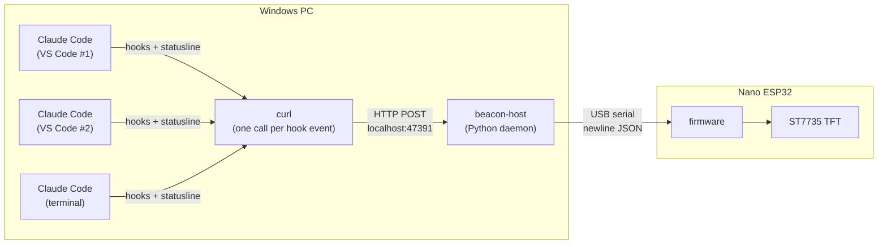

# Session Beacon

A small USB-attached status light for Claude Code. It shows, at a glance, every Claude Code session running on the machine, which ones are waiting on you, and a few coarse usage numbers, on a 1.8" colour TFT sitting next to the monitor.

The problem it solves: with three or four VS Code windows each running Claude Code, it is easy to leave one session blocked on a permission prompt for twenty minutes without noticing. Desktop notifications get lost or dismissed. A dedicated physical display does not.

---

## Hardware

| Part | Notes |
|------|-------|
| Arduino Nano ESP32 | ESP32-S3, native USB CDC serial, 3.3 V logic |
| 1.8" TFT, 128x160, ST7735 | SPI, 3.3 V, 8-pin header (same [JESSINIE module](https://www.amazon.com/dp/B0D31BGJWF) used in `env_monitoring`) |
| USB-C cable | Data + power, nothing else needed |

Wiring and display init are carried over from the `env_monitoring` firmware. See [docs/hardware.md](docs/hardware.md).

---

## How it works



1. **Claude Code hooks** fire on session lifecycle events. Each one is a single `curl` call to the daemon, which measured about eight times cheaper than starting a Python interpreter per event.
2. **beacon-host** keeps a per-session state machine (working / needs input / idle / ended), enriches it with cost and context data from the statusline hook, and pushes a compact snapshot to the device whenever anything changes.
3. **Firmware** is deliberately dumb: it parses the snapshot and draws it. All policy lives on the host so it can change without reflashing.

Details: [docs/architecture.md](docs/architecture.md), [docs/protocol.md](docs/protocol.md), [docs/claude-code-integration.md](docs/claude-code-integration.md).

---

## Status

Scoping and skeleton only. Nothing has been flashed or run yet. See [docs/roadmap.md](docs/roadmap.md) for the phased plan; Phase 1 is the first thing to build.

---

## Repository layout

```
firmware/beacon/          Arduino sketch for the Nano ESP32 (Arduino IDE, Adafruit_ST7735)
firmware/tft_smoketest/   Standalone wiring/display test, flash this first
host/                     Python daemon: hook receiver, state, serial link
  src/beacon_host/
hooks/                    Example Claude Code settings, plus a payload capture tool
scripts/                  install-hooks.ps1 (Claude Code hooks), install-task.ps1 (run at logon)
docs/                     Architecture, hardware, protocol, integration, roadmap
```

---

## Quick start (target, not yet working)

```powershell
# 0. Wire the display per docs/hardware.md, then flash firmware/tft_smoketest to check it

# 1. Flash the firmware
$cli = "$env:LOCALAPPDATA\Programs\Arduino IDE\resources\app\lib\backend\resources\arduino-cli.exe"
& $cli compile --fqbn arduino:esp32:nano_nora firmware/beacon
& $cli upload  --fqbn arduino:esp32:nano_nora -p COM4 firmware/beacon

# 2. Run the host
cd host; uv sync
uv run beacon-host --dry-run -v      # sanity check without the board
uv run beacon-host                   # auto-detects the board by USB id

# 3. Install the Claude Code hooks, then RESTART your Claude Code sessions.
#    Without this the daemon runs happily and reports zero sessions forever.
./scripts/install-hooks.ps1              # -WithStatusLine for cost and context
curl.exe -s http://127.0.0.1:47391/health   # events_received should climb

# 4. Optional: start the daemon automatically at logon
./scripts/install-task.ps1
```

If the display says `no sessions`, the daemon and the wiring are fine and
Claude Code simply is not calling the hooks. Check `events_received` at
`/health`, then re-run `install-hooks.ps1` and restart your sessions.
