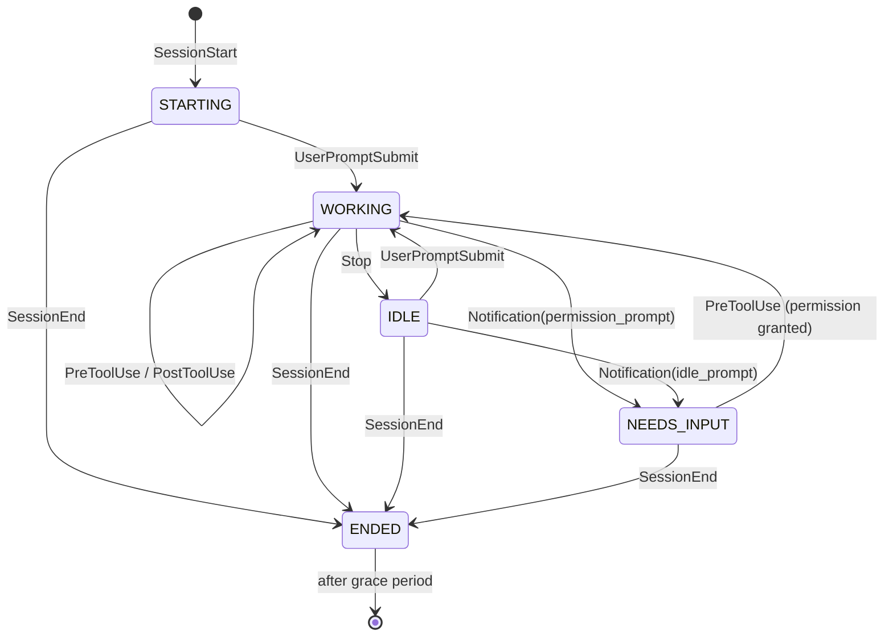

# Architecture

## Components

| Component | Where | Language | Responsibility |
|-----------|-------|----------|----------------|
| `beacon-hook` | `hooks/beacon_hook.py` | Python | Invoked by Claude Code on every hook event. Reads the JSON payload from stdin, POSTs it to the daemon, exits fast. Must never block Claude Code. |
| `beacon-host` | `host/src/beacon_host/` | Python | Long-running daemon. Receives hook events, maintains per-session state, talks to the device over USB serial. |
| firmware | `firmware/beacon/` | Arduino C++ | Reads newline-delimited JSON from USB serial, renders to the ST7735. No policy, no state beyond the last snapshot. |

## Why a daemon in the middle

Hooks are short-lived processes with no shared memory. Something has to own the serial port, hold state across events, and debounce redraws. Options considered:

- **Hook writes directly to serial.** Rejected. Multiple sessions would fight over the COM port, and no process would know the full picture.
- **Hook appends to a spool file, a separate script polls it.** Workable but adds file locking and a second process anyway.
- **Hook POSTs to a localhost HTTP daemon.** Chosen. One owner of the port, one owner of state, sub-millisecond hook cost. If the daemon is down the hook silently drops the event and exits 0.

## Session state machine

Each session is keyed by Claude Code's `session_id`. The display label is derived from `cwd` (basename of the repo directory) with an optional override map in the host config.



State semantics:

| State | Meaning | Colour |
|-------|---------|--------|
| `STARTING` | Session opened, no prompt yet | grey |
| `WORKING` | Claude is running (thinking or using tools) | blue |
| `NEEDS_INPUT` | Blocked on a permission prompt, or idle-waiting for you after a notification | red, blinking |
| `IDLE` | Claude finished its turn, waiting for the next prompt | green |
| `STALE` | `WORKING` but no event for `stale_after_s` (default 300 s) | amber |
| `ENDED` | Session closed; kept on screen briefly, then dropped | dim grey |

`STALE` catches crashed or killed VS Code windows that never sent `SessionEnd`. `ENDED` sessions are dropped after `ended_grace_s` (default 30 s).

Additional per-session info:

- **Elapsed time in current state** (e.g. "waiting 4m"). Computed on host, sent as seconds.
- **Cost and context usage** from the statusline command, when available. See [claude-code-integration.md](claude-code-integration.md).
- **Last tool name**, for a one-word hint of what it is doing. Optional, phase 2.

## Host daemon internals

```
beacon_host/
  main.py          CLI entry: parse args/config, start HTTP server + main loop
  hook_server.py   HTTP server on 127.0.0.1:47391, POST /event, POST /status
  state.py         SessionStore: apply_event(), tick(), snapshot()
  serial_link.py   Opens COM port, writes snapshot lines, reconnects on loss
  config.py        TOML config: port, label overrides, thresholds
```

Threading model: the HTTP server thread pushes events onto a queue. The main loop drains the queue, updates state, ticks staleness, and writes one line to serial if the snapshot changed or one second has passed (so the elapsed timers advance). Serial writes stay single-threaded.

Device discovery: `--port COMx` explicit, else auto-detect by USB VID/PID of the Nano ESP32 (VID 0x2341, PID 0x0070) via pyserial's port listing.

Daemon lifecycle on Windows: run at login via a Task Scheduler entry or a Startup-folder shortcut (`pythonw` so no console window). A tray icon is a possible later addition, not phase 1.

## Firmware internals

- Single sketch, Arduino IDE, same libraries as `env_monitoring` (Adafruit_GFX, Adafruit_ST7735) plus ArduinoJson.
- `Serial` (USB CDC) at 115200. Reads until newline, parses with a fixed-size ArduinoJson document (2 KB is plenty for 6 sessions).
- Repaints only changed regions, tracking what the header, each row, and the footer currently show. Software SPI makes a full repaint visible as a sweep, and the host resends a snapshot every second to advance timers, so this is not a premature optimisation.
- Shows a "no host" screen if nothing arrives for 10 s, so an unplugged or dead daemon is obvious.
- Optional heartbeat back to host so the host can log device presence.
- Accepts local commands on the same serial line so the layout can be exercised without a host. A line starting with `{` is a protocol message; anything else is a command, and `demo` loads a canned snapshot with running timers.

## Screen layout (160x128 landscape)

```
+----------------------------------------+
| BEACON      4 active          $4.20    |  header, 16 px
|----------------------------------------|
|############ env_monitoring      14m ####|  row 1, filled red, pulsing
| o session-beacon                 2m    |  row 2, blue dot
| o factory-dynamics               6m    |  row 3, amber dot
| o homelab                        7s    |  row 4, green dot
|                                        |
|                                        |
|----------------------------------------|
| ctx 41% [####......]          opus5    |  footer, 16 px: featured session
+----------------------------------------+
```

Six rows of 16 px fit between the header and the footer, using the default 6x8 GFX font at size 1.

**State is carried by colour, not by a word.** An earlier draft spelled the state out in each row, but the widest one, `NEEDS YOU`, needs 54 px, and a row only has 160 px to divide between the dot, a 16-character label, the state, and the age. That overcommits the row by eight pixels and the state text runs into the age. Dropping the word frees enough space that the label and the age can never collide.

| Element | x range | Notes |
|---------|---------|-------|
| Dot | 3 to 9 | Filled circle in the state colour |
| Label | 13 to 109 | Up to 16 characters, truncated by the host |
| Age | ends at 157 | Right-aligned, up to 4 characters |

That leaves 24 px of clear space between the longest label and the longest age.

Row colours:

| State | Dot | Row treatment |
|-------|-----|---------------|
| `need` | none, the row itself is the signal | Filled edge to edge, alternating red-on-black and black-on-red twice a second |
| `work` | blue | Plain |
| `idle` | green | Plain |
| `stale` | amber | Age also drawn amber |
| `start` | grey | Plain |
| `end` | dim grey | Label drawn grey |

The pulse alternates between two readable states rather than flashing text in and out, so the row reads as a pulse instead of a flicker. Because it is driven by a local timer, the host never has to send frames for it.

If more than six sessions are live, the host sorts `need` first, then `work`, then the rest, and the header's active count reveals the overflow.

**Only changed regions are repainted.** A full repaint over software SPI is slow enough to be visible as a sweep, and the host resends a snapshot every second purely to advance the timers. The device keeps a record of what each row currently shows and compares the *formatted* age string rather than the raw seconds, so a row showing `14m` stays untouched for a full minute. In steady state a snapshot costs nothing to draw.

## Non-goals (for now)

- No Wi-Fi, no MQTT, no cloud. USB only.
- No input on the device (buttons). Interaction is via the PC.
- No Linux host support in phase 1, though nothing in the design is Windows-specific except the COM port naming and the hook command line.
