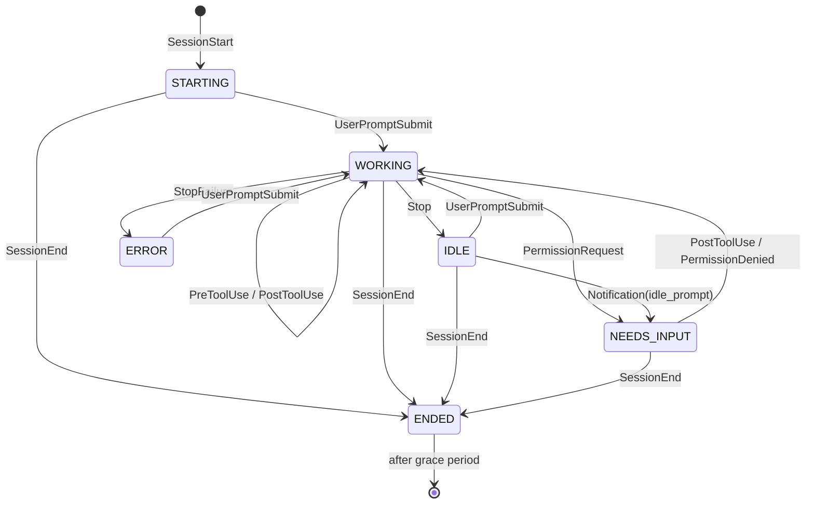

# Architecture

## Components

| Component | Where | Language | Responsibility |
|-----------|-------|----------|----------------|
| `beacon-hook` | `hooks/beacon_hook.py` | Python | Invoked by Claude Code on every hook event. Reads the JSON payload from stdin, POSTs it to the daemon, exits fast. Must never block Claude Code. |
| `beacon-host` | `host/src/beacon_host/` | Python | Long-running daemon. Receives hook events, maintains per-session state, talks to the device over USB serial. |
| firmware | `firmware/beacon/` | Arduino C++ | Reads newline-delimited JSON from USB serial, renders to the ST7735. No policy, no state beyond the last snapshot. |

## Why a daemon in the middle

Hooks are short-lived processes with no shared memory. Something has to own the serial port, hold state across events, and debounce redraws. Options considered:

- **Hook writes directly to serial.** Rejected. Multiple sessions would fight over the COM port, and no process would know the full picture.
- **Hook appends to a spool file, a separate script polls it.** Workable but adds file locking and a second process anyway.
- **Hook POSTs to a localhost HTTP daemon.** Chosen. One owner of the port, one owner of state, a cheap hook. If the daemon is down the POST fails instantly and the hook is a no-op.

### The forwarder is curl, not a script

Hooks run synchronously and the busiest of them fires on every tool call in every session, so the forwarder's process startup is the cost that matters. Measured on this machine, posting one event:

| Forwarder | Median | p90 |
|-----------|--------|-----|
| `curl.exe` from System32 | 15.6 ms | 28.1 ms |
| Python, system interpreter | 99.1 ms | 107.0 ms |
| Python, project venv | 121.9 ms | 134.7 ms |

curl ships with Windows, so this also removes any dependence on which Python is on `PATH` and any need to activate a virtual environment from a hook. The hook command is a single unquoted line.

`hooks/beacon_hook.py` remains as a portable fallback for machines without curl, and `hooks/capture_payloads.py` exists to record real payloads for fixtures.

### The daemon composes the status line

The statusline hook is also plain curl. It POSTs the payload to `/status` and the daemon returns the text to display in the response body, which curl prints. That keeps a second interpreter out of a path that runs on every status refresh.

The reply is composed purely from the payload just received, so the HTTP handler needs no shared state and no locking. The one external fact it uses is whether the device is currently connected, which appears as a `beacon` or `beacon?` marker at the end of the line. That makes a dead daemon or an unplugged display visible in the terminal without looking at the device.

`/event` replies `204` with an empty body, deliberately. Claude Code feeds some hooks' stdout back into the session as context, so the forwarder must print nothing.

## Session state machine

Each session is keyed by Claude Code's `session_id`. The display label is derived from `cwd` (basename of the repo directory) with an optional override map in the host config.



State semantics:

| State | Meaning | Colour |
|-------|---------|--------|
| `STARTING` | Session opened, no prompt yet | grey |
| `WORKING` | Claude is running (thinking or using tools) | blue |
| `NEEDS_INPUT` | Blocked on a permission prompt, or idle-waiting for you after a notification | red, pulsing |
| `ERROR` | The turn ended on an API error such as a rate limit or an overload | magenta |
| `IDLE` | Claude finished its turn, waiting for the next prompt | green |
| `STALE` | `WORKING` but no event for `stale_after_s` (default 300 s) | amber |
| `ENDED` | Session closed; kept on screen briefly, then dropped | dim grey |

`STALE` catches crashed or killed VS Code windows that never sent `SessionEnd`. `ENDED` sessions are dropped after `ended_grace_s` (default 30 s).

`ERROR` exists because without it a rate-limited session keeps looking busy until the staleness timer fires minutes later, which reads as a dead editor rather than as something that stopped and is waiting for you. Sort order puts it just below `NEEDS_INPUT`.

Additional per-session info:

- **Elapsed time in current state** (e.g. "waiting 4m"). Computed on host, sent as seconds.
- **Cost and context usage** from the statusline command, when available. See [claude-code-integration.md](claude-code-integration.md).
- **Last tool name**, for a one-word hint of what it is doing. Optional, phase 2.

## Host daemon internals

```
beacon_host/
  main.py          CLI entry: config, logging, signals, the main loop
  hook_server.py   HTTP on 127.0.0.1:47391: POST /event, POST /status, GET /health
  state.py         SessionStore: apply_event(), apply_status(), tick(), snapshot()
  statusline.py    Composes the text returned to the statusline hook
  serial_link.py   Opens the COM port, writes snapshots, reconnects on loss
  config.py        TOML config: port, label overrides, thresholds, logging
```

Threading model: the HTTP server thread pushes events onto a queue. The main loop drains the queue, updates state, ticks staleness, and writes one line to serial if the snapshot changed or one second has passed (so the elapsed timers advance). Serial writes stay single-threaded.

Device discovery: `--port COMx` explicit, else auto-detect by USB VID/PID of the Nano ESP32 (VID 0x2341, PID 0x0070) via pyserial's port listing.

Device handling assumes the link is never reliable. The board disappears on every reflash, Windows can move the COM number if the cable changes port, and the Arduino IDE's serial monitor will hold the port if it is open. Every send is best-effort, a failure just drops the link, and reconnection is attempted every two seconds. Port discovery falls back to USB VID/PID so a moved cable needs no config change.

Daemon lifecycle on Windows: `scripts/install-task.ps1` registers a Scheduled Task that starts it at logon with `pythonw.exe`, so there is no console window, and restarts it if it dies. A task rather than a service, because the daemon only matters while you are logged in and a task is far easier to inspect and remove. `GET /health` reports whether the device is connected, plus `sessions`, `events_received` and `last_event_age_s`. `events_received` is the field that separates "hooks not installed" from a daemon or wiring fault, and the daemon also logs a warning if a minute passes with no events at all. A tray icon is a possible later addition, not phase 1.

## Firmware internals

- Single sketch, Arduino IDE, same libraries as `env_monitoring` (Adafruit_GFX, Adafruit_ST7735) plus ArduinoJson.
- `Serial` (USB CDC) at 115200. Reads until newline, parses with a fixed-size ArduinoJson document (2 KB is plenty for 6 sessions).
- Repaints only changed *fields*, tracking what the header, each row, and the footer currently show. Measured on this panel over software SPI, a full-screen repaint costs about 900 ms, a full two-row repaint about 100 ms, and a field-level update of one row about 28 ms. Since the host resends a snapshot every second purely to advance timers, repainting everything would leave the device permanently mid-sweep, so this is not a premature optimisation. Hardware SPI would cut both figures by roughly an order of magnitude and needs no rewiring, but the partial-update path is already fast enough that it has not been worth the risk of changing.
- **Nothing is cleared to background before being drawn.** Every varying field is a
  fixed width at a fixed x, drawn with an opaque text background so each glyph erases
  the cell it replaces. Right-aligned values are space-padded into their field rather
  than repositioned, so a value going from `9s` to `10s` does not move. Clearing a row
  first and then drawing over it produced a visible flash once a second, because the
  row sat blank for the tens of milliseconds software SPI needs. A row is cleared only
  when its background colour genuinely changes, which for a steady session is never.
- **All timer comparisons go through `elapsed(now, since, ms)`, which uses a signed difference.** See the timing note below; a plain unsigned `now - then` caused a real and confusing bug.
- Shows a "no host" screen if nothing arrives for 10 s, so an unplugged or dead daemon is obvious.
- Shows a "no sessions" screen when the host is connected but reports nothing. These two failures have completely different causes and used to look identical: an empty screen. In practice "no sessions" means the Claude Code hooks were never installed, so the notice says so.
- Optional heartbeat back to host so the host can log device presence.
- Accepts local commands on the same serial line so the layout can be exercised without a host. A line starting with `{` is a protocol message; anything else is a command, and `demo` loads a canned snapshot with running timers.
- Reports counters in its heartbeat: lines received, parse failures, dropped lines, milliseconds since the last accepted message, and the last render duration. These exist because a quiet host and a device that is dropping or failing to parse lines look identical from the outside, namely a screen reading "no host".

### Timing: never subtract unsigned millis directly

The device alternated between the correct screen and "no host" roughly once a second. The cause was a stale timestamp, not the link.

`loop()` captured `now = millis()` at the top, then drained the serial buffer. Parsing a snapshot repaints the screen, which takes up to 900 ms, and `parseMessage()` stamps `lastMsgMs` when it finishes. So `lastMsgMs` ended up several hundred milliseconds *ahead* of `now`, and the staleness check `now - lastMsgMs > NO_HOST_MS` underflowed to about 4.3 billion. That is greater than every timeout, so the device painted "no host" directly over the frame it had just drawn correctly.

Two changes, both worth keeping:

- `loop()` reads serial first and takes `now` afterwards, so timestamps set during parsing are never in the future.
- Every timer comparison uses `elapsed(now, since, ms)`, which casts the difference to `int32_t`. That is wrap-safe across the 49-day `millis()` rollover and simply returns false if a timestamp is briefly ahead, rather than firing the timeout. The rollover would have caused the same failure once every seven weeks.

## Screen layout (160x128 landscape)

```
+----------------------------------------+
| BEACON      4 active          $4.20    |  header, 16 px
|----------------------------------------|
|############ env_monitoring      14m ####|  row 1, filled red, pulsing
| o session-beacon                 2m    |  row 2, blue dot
| o factory-dynamics               6m    |  row 3, amber dot
| o homelab                        7s    |  row 4, green dot
|                                        |
|                                        |
|----------------------------------------|
| ctx 41% [####......]          opus5    |  footer, 16 px: featured session
+----------------------------------------+
```

Six rows of 16 px fit between the header and the footer, using the default 6x8 GFX font at size 1.

**State is carried by colour, not by a word.** An earlier draft spelled the state out in each row, but the widest one, `NEEDS YOU`, needs 54 px, and a row only has 160 px to divide between the dot, a 16-character label, the state, and the age. That overcommits the row by eight pixels and the state text runs into the age. Dropping the word frees enough space that the label and the age can never collide.

| Element | x range | Notes |
|---------|---------|-------|
| Dot | 3 to 9 | Filled circle in the state colour |
| Label | 13 to 109 | Up to 16 characters, truncated by the host |
| Age | ends at 157 | Right-aligned, up to 4 characters |

That leaves 24 px of clear space between the longest label and the longest age.

Row colours:

| State | Dot | Row treatment |
|-------|-----|---------------|
| `need` | none, the row itself is the signal | Filled edge to edge, alternating red-on-black and black-on-red twice a second |
| `work` | blue | Plain |
| `idle` | green | Plain |
| `stale` | amber | Age also drawn amber |
| `err` | magenta | Age also drawn magenta |
| `start` | grey | Plain |
| `end` | dim grey | Label drawn grey |

The pulse alternates between two readable states rather than flashing text in and out, so the row reads as a pulse instead of a flicker. Because it is driven by a local timer, the host never has to send frames for it.

If more than six sessions are live, the host sorts `need` first, then `work`, then the rest, and the header's active count reveals the overflow.

**Only changed regions are repainted.** A full repaint over software SPI is slow enough to be visible as a sweep, and the host resends a snapshot every second purely to advance the timers. The device keeps a record of what each row currently shows and compares the *formatted* age string rather than the raw seconds, so a row showing `14m` stays untouched for a full minute. In steady state a snapshot costs nothing to draw.

## Non-goals (for now)

- No Wi-Fi, no MQTT, no cloud. USB only.
- No input on the device (buttons). Interaction is via the PC.
- No Linux host support in phase 1, though nothing in the design is Windows-specific except the COM port naming and the hook command line.
