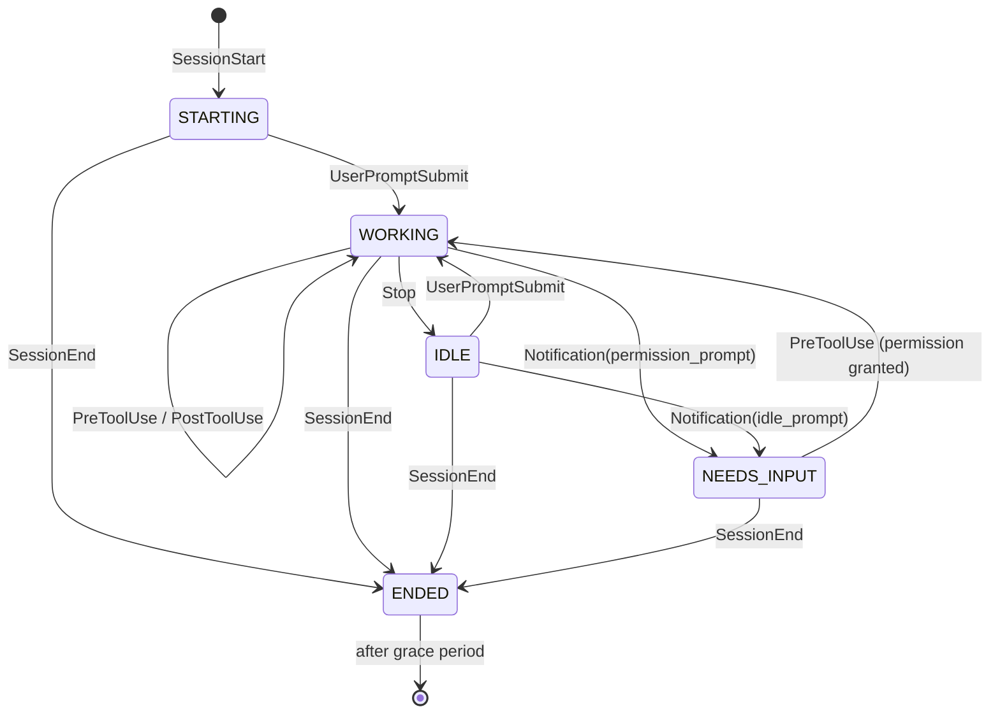

# Architecture

## Components

| Component | Where | Language | Responsibility |
|-----------|-------|----------|----------------|
| `beacon-hook` | `hooks/beacon_hook.py` | Python | Invoked by Claude Code on every hook event. Reads the JSON payload from stdin, POSTs it to the daemon, exits fast. Must never block Claude Code. |
| `beacon-host` | `host/src/beacon_host/` | Python | Long-running daemon. Receives hook events, maintains per-session state, talks to the device over USB serial. |
| firmware | `firmware/beacon/` | Arduino C++ | Reads newline-delimited JSON from USB serial, renders to the ST7735. No policy, no state beyond the last snapshot. |

## Why a daemon in the middle

Hooks are short-lived processes with no shared memory. Something has to own the serial port, hold state across events, and debounce redraws. Options considered:

- **Hook writes directly to serial.** Rejected. Multiple sessions would fight over the COM port, and no process would know the full picture.
- **Hook appends to a spool file, a separate script polls it.** Workable but adds file locking and a second process anyway.
- **Hook POSTs to a localhost HTTP daemon.** Chosen. One owner of the port, one owner of state, sub-millisecond hook cost. If the daemon is down the hook silently drops the event and exits 0.

## Session state machine

Each session is keyed by Claude Code's `session_id`. The display label is derived from `cwd` (basename of the repo directory) with an optional override map in the host config.



State semantics:

| State | Meaning | Colour |
|-------|---------|--------|
| `STARTING` | Session opened, no prompt yet | grey |
| `WORKING` | Claude is running (thinking or using tools) | blue |
| `NEEDS_INPUT` | Blocked on a permission prompt, or idle-waiting for you after a notification | red, blinking |
| `IDLE` | Claude finished its turn, waiting for the next prompt | green |
| `STALE` | `WORKING` but no event for `stale_after_s` (default 300 s) | amber |
| `ENDED` | Session closed; kept on screen briefly, then dropped | dim grey |

`STALE` catches crashed or killed VS Code windows that never sent `SessionEnd`. `ENDED` sessions are dropped after `ended_grace_s` (default 30 s).

Additional per-session info:

- **Elapsed time in current state** (e.g. "waiting 4m"). Computed on host, sent as seconds.
- **Cost and context usage** from the statusline command, when available. See [claude-code-integration.md](claude-code-integration.md).
- **Last tool name**, for a one-word hint of what it is doing. Optional, phase 2.

## Host daemon internals

```
beacon_host/
  main.py          CLI entry: parse args/config, start HTTP server + main loop
  hook_server.py   HTTP server on 127.0.0.1:47391, POST /event, POST /status
  state.py         SessionStore: apply_event(), tick(), snapshot()
  serial_link.py   Opens COM port, writes snapshot lines, reconnects on loss
  config.py        TOML config: port, label overrides, thresholds
```

Threading model: the HTTP server thread pushes events onto a queue. The main loop drains the queue, updates state, ticks staleness, and writes one line to serial if the snapshot changed or one second has passed (so the elapsed timers advance). Serial writes stay single-threaded.

Device discovery: `--port COMx` explicit, else auto-detect by USB VID/PID of the Nano ESP32 (VID 0x2341, PID 0x0070) via pyserial's port listing.

Daemon lifecycle on Windows: run at login via a Task Scheduler entry or a Startup-folder shortcut (`pythonw` so no console window). A tray icon is a possible later addition, not phase 1.

## Firmware internals

- Single sketch, Arduino IDE, same libraries as `env_monitoring` (Adafruit_GFX, Adafruit_ST7735) plus ArduinoJson.
- `Serial` (USB CDC) at 115200. Reads until newline, parses with a fixed-size ArduinoJson document (2 KB is plenty for 6 sessions).
- Redraws the full frame on every snapshot. At 160x128 a full redraw is a few milliseconds; no partial updates needed in phase 1. If flicker is visible, move to per-row dirty tracking.
- Shows a "no host" screen if nothing arrives for 10 s, so an unplugged or dead daemon is obvious.
- Optional heartbeat back to host so the host can log device presence.

## Screen layout (160x128 landscape)

```
+----------------------------------------+
| BEACON            3 active   $4.20     |  header, 16 px
|----------------------------------------|
| o session-beacon    working    2m      |  row 1
| o env_monitoring    NEEDS YOU  14m     |  row 2 (red, blinking)
| o homelab           idle       0m      |  row 3
| o factory-dyn       stale      6m      |  row 4
|                                        |
|                                        |
|----------------------------------------|
| ctx 62% [######....]  fable 5.1        |  footer, 16 px: featured session
+----------------------------------------+
```

Six rows of 16 px fit between header and footer using the default 6x8 GFX font at size 1 (a 14-char label is 84 px). If more than six sessions are live, the host sorts `NEEDS_INPUT` first, then `WORKING`, then the rest, and the header shows an overflow count.

Blinking is done on-device from the `need` state (toggle every 500 ms) so the host does not have to send frames for it.

## Non-goals (for now)

- No Wi-Fi, no MQTT, no cloud. USB only.
- No input on the device (buttons). Interaction is via the PC.
- No Linux host support in phase 1, though nothing in the design is Windows-specific except the COM port naming and the hook command line.
