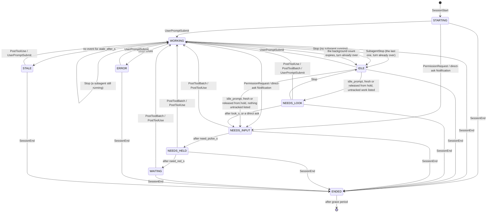

# Architecture

## Components

| Component | Where | Language | Responsibility |
|-----------|-------|----------|----------------|
| `beacon-hook` | `hooks/beacon_hook.py` | Python | Invoked by Claude Code on every hook event. Reads the JSON payload from stdin, POSTs it to the daemon, exits fast. Must never block Claude Code. |
| `beacon-host` | `host/src/beacon_host/` | Python | Long-running daemon. Receives hook events, maintains per-session state, talks to the device over USB serial. |
| firmware | `firmware/beacon/` | Arduino C++ | Reads newline-delimited JSON from USB serial, renders to the ST7735. No policy, no state beyond the last snapshot. |

## Why a daemon in the middle

Hooks are short-lived processes with no shared memory. Something has to own the serial port, hold state across events, and debounce redraws. Options considered:

- **Hook writes directly to serial.** Rejected. Multiple sessions would fight over the COM port, and no process would know the full picture.
- **Hook appends to a spool file, a separate script polls it.** Workable but adds file locking and a second process anyway.
- **Hook POSTs to a localhost HTTP daemon.** Chosen. One owner of the port, one owner of state, a cheap hook. If the daemon is down the POST fails instantly and the hook is a no-op.

### The forwarder is curl, not a script

Hooks run synchronously and the busiest of them fires on every tool call in every session, so the forwarder's process startup is the cost that matters. Measured on this machine, posting one event:

| Forwarder | Median | p90 |
|-----------|--------|-----|
| `curl.exe` from System32 | 15.6 ms | 28.1 ms |
| Python, system interpreter | 99.1 ms | 107.0 ms |
| Python, project venv | 121.9 ms | 134.7 ms |

curl ships with Windows, so this also removes any dependence on which Python is on `PATH` and any need to activate a virtual environment from a hook. The hook command is a single unquoted line.

`hooks/beacon_hook.py` remains as a portable fallback for machines without curl, and `hooks/capture_payloads.py` exists to record real payloads for fixtures.

### Native HTTP hooks were evaluated and not adopted

Claude Code has a native `http` hook type that would POST the payload to the
daemon with no process at all. It was checked against both the published
[hooks reference](https://code.claude.com/docs/en/hooks) and the CLI binary on
this machine (2.1.261), because in this project the binary has already been
right where the docs were wrong. The feature is real: `HttpHookSchema` takes
`url`, `timeout` in seconds, `headers` and `allowedEnvVars`, and a localhost
target is explicitly blessed rather than tolerated — the binary carries the
string "Loopback (127.0.0.1, ::1) is allowed for local dev". It was still not
adopted, for four reasons.

**The status line cannot follow.** `statusLine` accepts `"type": "command"` and
nothing else, so `curl.exe` stays on a path that runs on every status refresh
whatever the events do. Moving the nine lifecycle events to `http` halves the
process spawns at best; it does not remove the dependency, which was the point.

**The saving is below the noise floor.** `/health` reported 56 hook events in
60 minutes of ordinary use. Against the 15.6 ms median above, that is under a
second of added latency per hour, arriving as 56 separate 15 ms moments. The
8x margin over a Python forwarder in the table is real, but it is 8x of a
number small enough that the table exists to justify a choice already made,
not to chase further.

**Cross-platform config gains little.** The only Windows-specific token in the
hook commands is the absolute path `C:/Windows/System32/curl.exe`; elsewhere it
is just `curl`. The `statusLine` line needs that same edit for a Linux host
regardless, so an `http` block does not shrink the port.

**It would add a silent failure.** An unrecognised hook `type` is answered with
`Unknown hook type "..."` and the hook is skipped. On a Claude Code older than
the one that added `http`, every event would vanish and the display would go
blank — which is the symptom this project already warns is mistaken for a
hardware fault.

Two further details are worth recording so they do not have to be dug out of
the binary again. `async`, "hook runs in background without blocking", is a
field on the **command** hook schema only, not the HTTP one; an `http` hook
still blocks the turn, so it would not have bought non-blocking delivery
either. And an HTTP hook's response must be empty or JSON — "HTTP hook returned
empty body, treating as empty JSON object" — where a command hook's stdout is
free-form. The `timeout` would also have to be set explicitly: the documented
default for `http` hooks is 600 seconds, against `--max-time 1` today, so a
wedged daemon could stall a session instead of failing instantly.

What would change the answer:

- `statusLine` gaining a non-command type. That is the single change that would
  actually take `curl` out of the design, and it makes the rest of the argument
  collapse.
- A Linux or macOS host, where the whole configuration could then be one
  OS-independent block — but only if the status line comes along too.
- Spawn cost becoming visible under many concurrent sessions. This would
  announce itself rather than needing to be hunted: Claude Code warns with
  `Slow PostToolUse hooks:` and `--debug` prints a per-hook `durationMs`.

### The daemon composes the status line

The statusline hook is also plain curl. It POSTs the payload to `/status` and the daemon returns the text to display in the response body, which curl prints. That keeps a second interpreter out of a path that runs on every status refresh.

The reply is composed purely from the payload just received, so the HTTP handler needs no shared state and no locking. The one external fact it uses is whether the device is currently connected, which appears as a `beacon` or `beacon?` marker at the end of the line. That makes a dead daemon or an unplugged display visible in the terminal without looking at the device.

`/event` replies `204` with an empty body, deliberately. Claude Code feeds some hooks' stdout back into the session as context, so the forwarder must print nothing. That answer happens to satisfy the HTTP hook contract as well, where a response body must be empty or JSON, so the constraint now has two independent reasons behind it.

## Session state machine

Each session is keyed by Claude Code's `session_id`.

**The label is the enclosing repository, not the working directory.** `cwd` in a hook
payload is the session's live working directory and it moves as you work. Labelling
straight from it meant a session in this repo displayed as `host` the moment anything
ran in `host/`, and because the label was only computed once it then stayed wrong for
the rest of the session. The host now walks up from `cwd` to the nearest ancestor
holding a `.git` entry and uses that name, recomputing whenever `cwd` changes. Results
are cached, since hooks fire on every tool call and this touches the filesystem.

Overrides in the host config are matched against both the exact `cwd` and the resolved
repository root, so keying them by repo root works.

This diagram is written in hook events, for working on the code. The README has
[the same machine as the display shows it](../README.md#what-the-colours-mean).



"Direct ask" means `PermissionRequest`, or a `Notification` of type
`permission_prompt`, `elicitation_dialog`, `elicitation_url_dialog` or
`agent_needs_input`. "Untracked work" is any live `background_tasks` entry other
than a `subagent`, a `monitor`, `dream` or `auto-mode scan`; see
[the soft rung](#the-soft-rung-needs_look).

State semantics:

| State | Meaning | Colour |
|-------|---------|--------|
| `STARTING` | Session opened, no prompt yet | grey |
| `WORKING` | Claude is running (thinking or using tools) | blue |
| `NEEDS_INPUT` | Blocked on a permission prompt, or idle-waiting for you after a notification. The first two minutes of it | red, pulsing |
| `NEEDS_HELD` | Same thing, two to ten minutes in | red, static |
| `WAITING` | Same thing, over ten minutes in | amber |
| `NEEDS_LOOK` | Claude has gone idle, but a workflow, a background shell or similar is still running. Joins `NEEDS_INPUT` after `look_s` (default 300 s) | cyan |
| `ERROR` | The turn ended on an API error such as a rate limit or an overload | magenta |
| `IDLE` | Claude finished its turn, waiting for the next prompt | green |
| `STALE` | `WORKING` but no event for `stale_after_s` (default 300 s) | amber |
| `ENDED` | Session closed; kept on screen briefly, then dropped | dim grey |

`Stop` means the turn ended, not that a human is needed: it carries `background_tasks`, and a turn that ends with a subagent still running stays `WORKING`. Calling it `IDLE` let the next `idle_prompt` paint a red row with nothing to act on. See [claude-code-integration.md](claude-code-integration.md#hook-events-we-register).

**Only a subagent counts.** `background_tasks` is every kind of in-flight work the
session has registered — `subagent`, `shell`, `monitor`, `workflow`, `MCP task`,
`teammate`, `cloud session` — and reading it as "subagents still running" cost a
session eight minutes of blue followed by amber while it sat waiting on a human. It
had no subagents at all. It had two armed artifact comment monitors, which register
as `monitor` tasks for the life of the session.

The reason only `subagent` counts is not that the others are less real. It is that
the beacon has machinery for exactly one of them: `SubagentStop` retires a subagent,
and a subagent's own hook events refresh the freshness stamp. Nothing announces the
end of any other type, so counting one is a guess that can only mute the display,
and a `monitor` never ends at all — the count could only ever go up, and a session
that had used the artifact tooling could never be shown as waiting on you again.
An unrecognised `type` is ignored for the same reason: a wrongly ignored task shows
a red row that de-escalates in ten minutes and clears on the next tool call, while a
wrongly counted one that never ends silences the session for good.

**That count has to be able to come back down.** It used to be recomputed only on
the next `Stop` or `UserPromptSubmit`, and a turn that has already ended and is
waiting on you produces neither -- so a count left positive suppressed every
`idle_prompt` the session would ever send, and the row stayed blue however long you
left it. `SubagentStop` is registered for exactly this: it fires when a subagent
ends, carries a fresh `background_tasks`, and drops the row to `IDLE` when it was
the last of them and the turn was already over.

**And the hold expires in `tick()`, in one place.** A count nothing has confirmed
for `bg_quiet_s` (default 180 s) is retired outright: the row hands back to `IDLE`
if its turn was already over, and whatever the count was suppressing is released. A
running subagent refreshes the stamp constantly with its own hook events, so a
genuinely busy session is never escalated. Doing this in `tick()` rather than inside
the branch that consults the count is what makes `IDLE` reachable at all — the
alternative was the row sitting on `WORKING` until the staleness timer turned it
amber, which is the worst answer available, because `stale` sorts *below* `work`.

**A held `idle_prompt` is not a lost one.** It used to be dropped, on the assumption
that a later one would get through. Claude Code sends them "after Claude has been
waiting a while", which sounds like a repeat and is not a promise of one: for the
idle period that turned this up it sent exactly one, 183 seconds after the turn
ended, against a 180-second hold that had re-armed itself at the `Stop`. Three
seconds decided whether the row was ever red. It is now remembered on the session
and delivered when the hold expires or the count retires, so which side of the
window it lands on no longer matters and nothing depends on a second one arriving.

`STALE` catches crashed or killed VS Code windows that never sent `SessionEnd`. `ENDED` sessions are dropped after `ended_grace_s` (default 30 s).

`ERROR` exists because without it a rate-limited session keeps looking busy until the staleness timer fires minutes later, which reads as a dead editor rather than as something that stopped and is waiting for you. Sort order puts it just below the red rungs of the attention ladder.

### The attention ladder

A session waiting on a human used to pulse red until something happened to it,
and nothing in `tick()` ever retired that state. On this machine `/health`
caught two sessions that had been pulsing for **13 hours and 9.7 hours**. Leaving
a session parked is the normal way to work, so an alarm that never stops is
wrong far more often than it is right, and an alarm that is usually wrong stops
being read at all.

`NEEDS_INPUT` is therefore three rungs, timed from when the session entered the
family, not from the previous rung:

| Rung | Elapsed | Treatment |
|------|---------|-----------|
| `NEEDS_INPUT` | 0 to `need_pulse_s` (120 s) | Filled red, pulsing |
| `NEEDS_HELD` | to `need_red_s` (600 s) | Filled red, static |
| `WAITING` | after that | An ordinary row with an amber dot |

Four details are load-bearing, and each looks like a mistake until you know why.

**Only the agent that raised a prompt can end the wait.** A subagent's hook events
carry the *parent's* `session_id`, so treating them as the parent's own repainted a
genuinely blocked row `WORKING` on every tool call the subagent made -- a session
waiting on you could show blue indefinitely, which is the one thing the device is
for. A tool event now clears an attention state only when its `agent_id` matches
the one recorded when the session entered the family (`""` being the main thread).
`PostToolBatch` still clears a prompt answered with feedback, and a subagent's own
`PostToolBatch` still clears a prompt that subagent raised. The event refreshes the
staleness timer regardless, because a long subagent run is the only traffic its
session produces.

**Re-entering the family does not restart the ladder.** `idle_prompt` fires
whenever Claude has been waiting a while, so an unanswered session is notified
again and again. Re-arming on each notification would pulse forever, which is
the exact behaviour the ladder removes. This is observed, not inferred: two
`idle_prompt` notifications were captured for the same session minutes apart with
no answer in between, which is how a row stays red for 13 hours. `_want_attention()` starts the ladder only on entry from
outside; a tool call, a prompt or a `Stop` is what re-arms it.

**The rungs do not reset `state_since`.** Every other transition goes through
`set_state()`, which does. Here `state_since` is both the age on screen and the
ladder's own origin, so resetting it would restart the age mid-wait and re-base
the second threshold, putting `wait` twelve minutes in instead of ten.

**`WAITING` sorts below `WORKING`, next to `STALE`.** It is where sessions left
idle on purpose end up, so ranking it with the alarm states would park them in
the top rows permanently and push actively working sessions off a six-row
display. That is the same noise in a different place. Sinking the last rung is
what makes the ladder subtract from the display rather than rearrange it.

`WAITING` and `STALE` are drawn identically, which is a decision rather than a
collision. "Busy but gone quiet" and "waiting on you for a while" ask a person
for the same thing — look at this one when you get a chance — and in both the
age is the informative part. They stay distinct on the wire so `/health`, the
docs and the sort can tell them apart.

Both thresholds are config, next to `stale_after_s`.

### The soft rung: NEEDS_LOOK

An orchestrator session, `inventory-service2`, went filled red and pulsing while
it waited on a background `workflow` task. Nothing was blocked. The row cleared
itself the moment the session's own thread touched a tool again. The mechanism is
the subagent false alarm again, one task type wider: only `subagent` is counted,
so the `Stop` read as "nothing running", the row went `IDLE`, and the next
`idle_prompt` skipped the hold and took the full alarm.

Widening the count is not the fix. Only a subagent can be retired (`SubagentStop`)
or confirmed alive (its own `agent_id` events), so counting anything else can only
mute the display, and a `monitor` never ends. That is the lesson of the monitor
bug above, and it still stands.

What was actually wrong is that the ladder had one severity for two different
messages. A permission prompt says "I cannot go on without you". An
`idle_prompt` says only "the main thread has been quiet a while", and while real
work is still running somewhere, that deserves a glance, not an alarm. So:

- A second count, `bg_other`, is kept beside `bg_tasks`. It holds live
  `background_tasks` entries that are neither a `subagent` nor work that never
  ends (`monitor`, `dream`, `auto-mode scan`). It **never** decides `WORKING`
  against `IDLE`. It only picks how loud an `idle_prompt` is.
- An `idle_prompt` that nothing holds back, with `bg_other` nonzero, gives
  `NEEDS_LOOK`: a cyan dot and a cyan age, sorted between `ERROR` and `WORKING`.
  With nothing outstanding it goes to `NEEDS_INPUT` as before. A direct ask
  (`PermissionRequest`, `permission_prompt`, the elicitation types,
  `agent_needs_input`) goes to `NEEDS_INPUT` however much work is running,
  including from a row that is already cyan.
- A held `idle_prompt` released by `tick()` goes through the same check, so a
  subagent retiring while a workflow is still listed lands on cyan, not red.

**The safety valve is a timer.** Nothing announces the end of a workflow, so
`NEEDS_LOOK` cannot wait for proof that the work finished. After `look_s`
(default 300 s) it graduates to `NEEDS_INPUT`, exactly where the unsoftened
notification would have gone. That is why unknown task types are counted here
while the subagent count ignores them: a wrong guess here costs at most `look_s`,
and the subagent count has no backstop at all. It also means a workflow that runs
longer than `look_s` still ends in red. That is the known limit, and the trade
against a session that really is waiting on you sitting cyan indefinitely.

Graduation goes through `set_state()`, so the age restarts and the ladder's two
and ten minutes count from the moment the alarm begins. The rungs deliberately do
not reset the age. Graduation does, because time spent cyan was not time spent
waiting on a human, by this state's own definition.

Repeat `idle_prompt`s leave a cyan row where it is, the same rule the ladder
follows, or the timer would never run out. Any tool event, a prompt, or a `Stop`
takes the row out of `NEEDS_LOOK`. It is not in the attention family, so unlike a
red row it does not wait for the agent that raised it.

Additional per-session info:

- **Elapsed time in current state** (e.g. "waiting 4m"). Computed on host, sent as seconds.
- **Cost and context usage** from the statusline command, when available. See [claude-code-integration.md](claude-code-integration.md).
- **Last tool name**, for a one-word hint of what it is doing. Optional, phase 2.

## Host daemon internals

```
beacon_host/
  main.py          CLI entry: config, logging, signals, the main loop
  hook_server.py   HTTP on 127.0.0.1:47391: POST /event, POST /status, GET /health
  state.py         SessionStore: apply_event(), apply_status(), tick(), snapshot()
  statusline.py    Composes the text returned to the statusline hook
  serial_link.py   Opens the COM port, writes snapshots, reconnects on loss
  persist.py       Saves and restores the session store across daemon restarts
  capture.py       Redacts and appends hook payloads to JSONL, for fixtures
  config.py        TOML config: port, label overrides, thresholds, logging
```

Threading model: the HTTP server thread pushes events onto a queue. The main loop drains the queue, updates state, ticks staleness, and writes one line to serial if the snapshot changed or one second has passed (so the elapsed timers advance). Serial writes stay single-threaded.

Device discovery: `--port COMx` explicit, else auto-detect by USB VID/PID of the Nano ESP32 (VID 0x2341, PID 0x0070) via pyserial's port listing.

**The daemon will not share its port.** `HTTPServer` sets `allow_reuse_address`, and on Windows `SO_REUSEADDR` lets a *second* process bind an address another process is already listening on — unlike Linux, where it only skips the `TIME_WAIT` delay. So a second daemon started cleanly, the "another beacon-host running?" check never fired, and the two split hook events between them at random. That was easy to hit by accident, because the quick start asks you to run `beacon-host --dry-run -v` and by step 5 the scheduled task is already running. That step now says to stop the task first, and the failure is loud rather than silent either way.

The socket now refuses to be shared, which turns that silent split into a clear error. Two details make the strictness safe: the listening socket is closed on shutdown rather than at process exit, and the bind is retried for five seconds before giving up. A predecessor still exiting releases the port in well under a second, while a daemon that is genuinely running is still there at the end — so a fast restart succeeds and a real duplicate is still reported.

**Session state survives a restart.** A session parked on a prompt sends no hook events at all, so there is nothing to re-register it. Holding state only in memory meant that every restart — at logon, after a crash, or to free the COM port for a reflash — silently dropped every waiting session, and the display then under-reported until each one was next touched. Worse, the symptom is a short display, which the troubleshooting guide otherwise blames on missing hooks: the wrong trail entirely.

The store is written to `sessions.json` beside the log whenever the snapshot actually changes, throttled to once every five seconds, and again on a clean stop. Writes go to a temporary file and are then renamed, so an interrupted write cannot leave a truncated file that fails to load on every subsequent start.

Timestamps are absolute and are not rebased on load: a session that has been waiting three hours should still read three hours. The consequence is that a session that was *working* when the daemon went down comes back past its staleness threshold and shows amber, which is honest — from the daemon's side it has been silent that long — and the next tool call corrects it.

Nothing tells the daemon that a window was closed while it was down, because `SessionEnd` would have gone nowhere. A row untouched for longer than `restore_max_age_s` (default 24 h) is therefore treated as a ghost and dropped rather than restored. `--no-persist` turns the whole thing off, and `--dry-run` never persists, so debugging cannot disturb the real daemon's state.

**Ghosts are dropped on two more occasions.** A Windows Update restart killed a session with no `SessionEnd`. The daemon restored it at logon as though it were parked. It was 21 hours old at the next daemon restart, so it was restored again, and it stayed on the display for 45 hours until a restart finally found it over the cutoff. Two holes let that happen, and both are closed:

- **Across a reboot, nothing is restored.** No Claude Code process survives one, so if the machine booted after `sessions.json` was saved, every session in it is dead. The boot time is now minus `GetTickCount64`, which counts time asleep, so waking from sleep does not discard live sessions. Fast Startup is the known miss: its shutdown hibernates the kernel, so uptime carries on while every user process is killed.
- **The 24-hour cutoff also applies while the daemon runs.** `tick()` drops any session with no hook event for `restore_max_age_s`, whatever its state. Before this, the cutoff applied only at load, so a ghost lived as long as the daemon did and any restart inside the window renewed it. The age runs from the last event, not from `state_since`: a parked `wait` row keeps its age across repeat notifications, and those repeats are what prove it is alive.

The log rotates at 1 MB with three backups, so it never exceeds about 4 MB. At INFO it grows a few kilobytes a day, mostly start-up and reconnect lines.

Device handling assumes the link is never reliable. The board disappears on every reflash, Windows can move the COM number if the cable changes port, and the Arduino IDE's serial monitor will hold the port if it is open. Every send is best-effort, a failure just drops the link, and reconnection is attempted every two seconds. Port discovery falls back to USB VID/PID so a moved cable needs no config change.

Daemon lifecycle on Windows: `scripts/install-task.ps1` registers a Scheduled Task that starts it at logon with `pythonw.exe`, so there is no console window, and restarts it if it dies. A task rather than a service, because the daemon only matters while you are logged in and a task is far easier to inspect and remove. `GET /health` reports whether the device is connected, plus `sessions`, `events_received`, `last_event_age_s`, `uptime_s`, `rows`, which is what is currently on the display, and `bg`, which is why a row is *not* red. Answering "why does the screen say that" should not require a serial cable. `events_received` is the field that separates "hooks not installed" from a daemon or wiring fault, and the daemon also logs a warning if a minute passes with no events at all. `bg` does the same job for the other silent failure: a row held behind a background count looks exactly like a session that is genuinely busy, and working out which needed the persisted state file plus the session's own transcript. It carries the outstanding subagent count, the untracked-work count behind a `look` row (`other`), whether the turn had ended, whether an `idle_prompt` is being held, and how long ago the count was last confirmed — and it is empty unless a session has something outstanding. A tray icon is a possible later addition, not phase 1.

## Firmware internals

- Single sketch, Arduino IDE, same libraries as `env_monitoring` (Adafruit_GFX, Adafruit_ST7735) plus ArduinoJson.
- `Serial` (USB CDC) at 115200. Reads until newline, parses with an ArduinoJson 7 `JsonDocument`, which sizes itself on the heap; the old fixed-capacity `StaticJsonDocument` is gone from that library. A line longer than the 1024-byte buffer is discarded whole, remainder included, and counted in the heartbeat's `drop`.
- Repaints only changed *fields*, tracking what the header, each row, and the footer currently show. Measured on this panel over software SPI, a full-screen repaint cost about 900 ms, a full two-row repaint about 100 ms, and a field-level update of one row about 28 ms. Since the host resends a snapshot every second purely to advance timers, repainting everything would have left the device permanently mid-sweep, so this is not a premature optimisation. The sketch has since moved to hardware SPI at 24 MHz, which cut those figures by roughly an order of magnitude and needed no rewiring; the partial-update path is kept because the reasoning holds at any speed, and `USE_HARDWARE_SPI 0` reverts to bit-banging the same pins.
- **Nothing is cleared to background before being drawn.** Every varying field is a
  fixed width at a fixed x, drawn with an opaque text background so each glyph erases
  the cell it replaces. Right-aligned values are space-padded into their field rather
  than repositioned, so a value going from `9s` to `10s` does not move. Clearing a row
  first and then drawing over it produced a visible flash once a second, because the
  row sat blank for the tens of milliseconds software SPI needs. A row is cleared only
  when its background colour genuinely changes, which for a steady session is never.
- **All timer comparisons go through `elapsed(now, since, ms)`, which uses a signed difference.** See the timing note below; a plain unsigned `now - then` caused a real and confusing bug.
- Shows a "no host" screen if nothing arrives for 10 s, so an unplugged or dead daemon is obvious.
- Shows `no statusline data` in the footer when no cost or context has ever arrived. That data reaches the host only through the statusline hook, which is optional, so the strip was otherwise simply blank and read as a broken display rather than a feature that was never switched on.
- Shows a "no sessions" screen when the host is connected but reports nothing. These two failures have completely different causes and used to look identical: an empty screen. In practice "no sessions" means the Claude Code hooks were never installed, so the notice says so.
- Optional heartbeat back to host so the host can log device presence.
- Accepts local commands on the same serial line so the layout can be exercised without a host. A line starting with `{` is a protocol message; anything else is a command, and `demo` loads a canned snapshot with running timers.
- Reports counters in its heartbeat: lines received, parse failures, dropped lines, milliseconds since the last accepted message, and the last render duration. These exist because a quiet host and a device that is dropping or failing to parse lines look identical from the outside, namely a screen reading "no host".

### Timing: never subtract unsigned millis directly

The device alternated between the correct screen and "no host" roughly once a second. The cause was a stale timestamp, not the link.

`loop()` captured `now = millis()` at the top, then drained the serial buffer. Parsing a snapshot repaints the screen, which takes up to 900 ms, and `parseMessage()` stamps `lastMsgMs` when it finishes. So `lastMsgMs` ended up several hundred milliseconds *ahead* of `now`, and the staleness check `now - lastMsgMs > NO_HOST_MS` underflowed to about 4.3 billion. That is greater than every timeout, so the device painted "no host" directly over the frame it had just drawn correctly.

Two changes, both worth keeping:

- `loop()` reads serial first and takes `now` afterwards, so timestamps set during parsing are never in the future.
- Every timer comparison uses `elapsed(now, since, ms)`, which casts the difference to `int32_t`. That is wrap-safe across the 49-day `millis()` rollover and simply returns false if a timestamp is briefly ahead, rather than firing the timeout. The rollover would have caused the same failure once every seven weeks.

## Screen layout (160x128 landscape)

```
+----------------------------------------+
| BEACON      4 active          $4.20    |  header, 16 px
|----------------------------------------|
|############ env_monitoring     44s ####|  row 1, filled red, pulsing
|############ data-pipeline       5m ####|  row 2, filled red, static
| o session-beacon                 2m    |  row 3, blue dot
| o homelab                        7s    |  row 4, green dot
|                                        |
|                                        |
|----------------------------------------|
| ctx 41% [####......]          opus5    |  footer, alternates every 4 s
+----------------------------------------+
```

Six rows of 16 px fit between the header and the footer, using the default 6x8 GFX font at size 1.

**State is carried by colour, not by a word.** An earlier draft spelled the state out in each row, but the widest one, `NEEDS YOU`, needs 54 px, and a row only has 160 px to divide between the dot, a 16-character label, the state, and the age. That overcommits the row by eight pixels and the state text runs into the age. Dropping the word frees enough space that the label and the age can never collide.

| Element | x range | Notes |
|---------|---------|-------|
| Featured marker | 0 to 1 | Present only on the session the footer describes |
| Dot | 3 to 9 | Filled circle in the state colour |
| Label | 13 to 109 | Up to 16 characters. The host shortens longer ones from the middle (`inventory..vice2`), so clones that differ only in a suffix stay distinct |
| Age | ends at 157 | Right-aligned, up to 4 characters |

That leaves 24 px of clear space between the longest label and the longest age.

Row colours:

| State | Dot | Row treatment |
|-------|-----|---------------|
| `need` | none, the row itself is the signal | Filled edge to edge, alternating red-on-black and black-on-red twice a second |
| `held` | none, as `need` | Filled edge to edge in red, static. Drawn once and never repainted |
| `wait` | amber | Age also drawn amber. Identical to `stale`, deliberately |
| `look` | cyan | Age also drawn cyan. The age carries it because `work`'s blue is already an azure, too close for a 7 px dot alone |
| `work` | blue | Plain |
| `idle` | green | Plain |
| `stale` | amber | Age also drawn amber |
| `err` | magenta | Age also drawn magenta |
| `start` | grey | Plain |
| `end` | dim grey | Label drawn grey |

### The footer alternates

It carries two pages, four seconds each:

```
| ctx  54% [#####.....]         opus5    |   the featured session
| 5h   92% [#########.]       7d  28%    |   this account's usage
```

The context page describes **one** session, the one at `sel`, and that row carries a
two-pixel marker down its left edge so it is visible which. The marker takes the
label's colour, so it adapts to the state for free: white normally, black against the
filled attention row, grey on an ended one. It stays put rather than appearing only
while the context page is up, because a marker blinking every four seconds would be
worse than a slightly imprecise one. The usage page is account-wide and belongs to no
row.

Both pages put their three fields at identical positions, so alternating does not
make anything jump: an eight-character value on the left, the same bar, an
eight-character value on the right. The bar is coloured by threshold either way,
so a five-hour window at 92% turns it red exactly as a nearly-full context window
does.

It only alternates when both pages have something to say. With no account figures
it parks on the session page, and with no session context it parks on the usage
page, so nothing ever blinks at a blank second page.

Rate limits arrive only with a statusline refresh, so the host drops them from the
snapshot after five minutes without one. A percentage from an hour ago is worse
than no percentage when the whole point is knowing where you stand now.

The pulse alternates between two readable states rather than flashing text in and out, so the row reads as a pulse instead of a flicker. Because it is driven by a local timer, the host never has to send frames for it.

Only `need` is repainted on the blink tick. A `held` row is the same fill held permanently in the phase `need` spends half its time in, so it is drawn once and then costs nothing per frame however many of them are on screen.

If more than six sessions are live, the host sorts the red rungs first, then `err`, then `look`, then `work`, then the rest, and the header's active count reveals the overflow. Sessions that have been waiting long enough to reach `wait` sort below `work`, so a row of parked sessions cannot push a working one off the display.

**Only changed regions are repainted.** A full repaint over software SPI is slow enough to be visible as a sweep, and the host resends a snapshot every second purely to advance the timers. The device keeps a record of what each row currently shows and compares the *formatted* age string rather than the raw seconds, so a row showing `14m` stays untouched for a full minute. In steady state a snapshot costs nothing to draw.

## Non-goals (for now)

- No Wi-Fi, no MQTT, no cloud. USB only.
- No input on the device (buttons). Interaction is via the PC.
- No Linux host support in phase 1, though nothing in the design is Windows-specific except the COM port naming and the hook command line.
