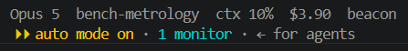
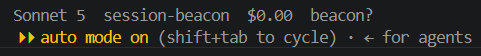

# Claude Code integration

Everything the beacon knows comes from two Claude Code features: **hooks** and the **statusline command**. Both are configured in `~/.claude/settings.json` and apply to every session on the machine, which is exactly what we want.

Field names below have been checked against payloads captured on this machine, not just against the published schemas, and the two disagree. Reference: [hooks](https://code.claude.com/docs/en/hooks), [statusline](https://code.claude.com/docs/en/statusline).

## Fields every hook receives

```json
{
  "session_id": "...",
  "prompt_id": "...",
  "transcript_path": "...",
  "cwd": "...",
  "permission_mode": "default|plan|acceptEdits|auto|dontAsk|bypassPermissions",
  "hook_event_name": "...",
  "agent_id": "...",
  "agent_type": "..."
}
```

Two of these are more useful than they first look:

- **`permission_mode`** says whether a session can block on you at all. One running in `bypassPermissions` will never raise a permission prompt, so a long silence there means something different than it does elsewhere. Captured now, displayed later.
- **`agent_id` and `agent_type`** are present only inside subagents. Subagent activity is therefore distinguishable from the parent's, which contradicts an earlier note in this file claiming it was not.

`SessionStart` carries `source`, with the value `startup` observed. `SessionEnd` carries `reason`, with `other` observed. Both differ from the published schema; see the verification section below.

## Hook events we register

| Event | Fires when | Beacon transition |
|-------|-----------|-------------------|
| `SessionStart` | Session opens, resumes, clears, compacts, or forks | Create session as `STARTING` |
| `UserPromptSubmit` | You send a prompt | `WORKING`, clears any error |
| `PostToolUse` | After each tool call, carries `tool_name` | `WORKING`, refreshes the staleness timer |
| `PermissionRequest` | Claude Code needs permission for a tool | `NEEDS_INPUT`, if not already waiting |
| `PermissionDenied` | You denied it | `WORKING`, the prompt was answered |
| `Notification` | Claude Code wants attention, carries `notification_type` | `NEEDS_INPUT` for the attention types below, if not already waiting |
| `Stop` | Claude finished its turn, carries `background_tasks` | `IDLE`, or `WORKING` if background work is still running |
| `StopFailure` | The turn ended on an API error, carries `error_type` | `ERROR` |
| `SessionEnd` | Session closes | `ENDED` |

**`PermissionRequest` is a dedicated event.** An earlier draft of this design watched `Notification` for `permission_prompt` instead. The dedicated event is more precise and arrives without depending on notification settings, so it is now the primary signal, with the notification kept as a second path.

**`PreToolUse` is deliberately not registered.** `PostToolUse` alone is enough for activity and staleness, and skipping `PreToolUse` halves the hook cost on the busiest event. Turn it on only if a hint of what a session is *about* to do turns out to be worth the latency. The state machine handles it either way.

**`StopFailure` closes a real gap.** Its `error_type` covers `rate_limit`, `overloaded`, `billing_error`, `authentication_failed`, and others. Without this event a session that died on a rate limit keeps looking busy until the staleness timer fires five minutes later, which reads as a crashed editor rather than as something waiting on you.

### Notification types that mean a human is needed

The documented `notification_type` values include far more than attention prompts. The beacon treats these as `NEEDS_INPUT`:

`permission_prompt`, `idle_prompt`, `elicitation_dialog`, `elicitation_url_dialog`, `agent_needs_input`

The rest are informational and only refresh the activity timer: `auth_success`, `elicitation_complete`, `elicitation_response`, `agent_completed`, and the `quota_auto_resume_*` family. `idle_prompt` fires after Claude has been waiting a while, which catches the case where you were asked a question and did not notice.

**`Stop` does not always mean you are up.** It carries `background_tasks`, and a
turn that ends with a subagent still running has handed nothing back to a human.
Observed shape:

```json
"background_tasks": [{"id": "a7c03d1af2...", "type": "subagent",
                      "agent_type": "Explore", "status": "running",
                      "description": "..."}]
```

Treating that as `IDLE` produced a real false alarm: the session went green, the
next `idle_prompt` escalated it to a pulsing red row, and there was nothing for
anyone to do. A session with running tasks is `WORKING` instead, and `idle_prompt`
is held back while any are outstanding.

Only `idle_prompt` is held back. It means no more than "Claude has been waiting a
while", which is not the same as waiting on a person. The other attention types
are direct asks — a permission prompt raised inside a subagent still needs
answering — so they escalate regardless. A task with no `status` counts as
running, because assuming it had finished is exactly the mistake that produces
the false alarm.

Note that this is intermittent rather than reliable, which is what made it
awkward to catch: a subagent's own `PostToolUse` events carry the parent's
`session_id` and keep flipping the row back to `WORKING`, so the red only appears
when an `idle_prompt` lands in a quiet gap.

**A repeat notification does not restart the alarm.** `idle_prompt` fires again and again while nobody answers, so a session already on the attention ladder only has its activity timer refreshed; the rung it has reached is left alone. Without that the display would re-arm the pulse every few minutes and a parked session would blink indefinitely, which is what it used to do. See [the attention ladder](architecture.md#the-attention-ladder).

### Timing

Hooks run synchronously and block the flow until the command exits, so the forwarder must be fast. It does a single HTTP POST with a 200 ms timeout and swallows every error. Measured during scoping at roughly 170 ms per invocation through `uv run`, which carries uv's own startup; a direct interpreter path should be nearer 50 ms. Measure before deciding whether `PreToolUse` is affordable.

## Statusline for cost and context

The statusline command receives JSON on stdin on every refresh. It is a *command*
and only a command: `statusLine` accepts `"type": "command"` and no other kind in
2.1.261, unlike hooks, which also take `http`, `prompt`, `mcpTool` and `agent`. That
is why the beacon keeps a `curl` dependency; see
[architecture.md](architecture.md#native-http-hooks-were-evaluated-and-not-adopted).
The fields the beacon uses:

| Field | Use |
|-------|-----|
| `session_id` | Joins to the hook stream |
| `workspace.current_dir` | Label, preferred over the top-level `cwd` |
| `model.display_name` | Shortened to fit the footer |
| `cost.total_cost_usd` | Summed across sessions for the header |
| `context_window.used_percentage` | Footer bar, pre-calculated |
| `context_window.total_input_tokens`, `.total_output_tokens`, `.context_window_size` | Fallback when the percentage is null |

That fallback matters: `used_percentage` is documented as null early in a session and again after a compaction until the next API call. Without it the footer would blank out at exactly the moments you are most likely to be looking.

### What it looks like

The installed status line is not a script. `curl` POSTs the payload to `/status`
and the daemon composes the reply, which curl prints; that keeps a second Python
interpreter off a path that runs on every status refresh. `beacon_hook.py
--statusline` does the same job and remains as a fallback for machines without
curl, but it prints a shorter line of its own.



Five fields, joined by two spaces, every one but the last omitted when it is
missing: model, the working directory's basename, context percentage, total cost,
and the marker. Note the basename — this is the one place the label is *not* the
enclosing repository, so a session working in `host/` reads as `host` here while
its row on the device still reads `session-beacon`.



`beacon?` is the daemon saying it is running but cannot see the device, which is
the difference between "the hooks are broken" and "the USB cable is out". It is
worth having in the terminal because the failure it reports is the one you cannot
diagnose by looking at the beacon.

That shot also happens to show the null-context case: there is no `ctx` segment
because `used_percentage` is null early in a session and after a compaction, and
the token fallback had nothing to work from either. A missing `ctx` is not a
second fault.

If you already have a custom statusline, `install-hooks.ps1` saves it and
`uninstall.ps1` puts it back.

### Account-level usage is available after all

An earlier version of this file said account-level rate limit figures were not exposed
to hooks or the statusline. That was wrong, and a captured payload disproves it. The
statusline carries:

```json
"rate_limits": {
  "five_hour":  { "used_percentage": 92, "resets_at": 1788571200 },
  "seven_day":  { "used_percentage": 28, "resets_at": 1788800400 }
}
```

Both a percentage and a reset time, for the rolling five-hour and seven-day windows.
That is the "high-level usage stats" this project was scoped around and assumed it
could not have. The footer now alternates every four seconds between the featured
session's context window and these account figures; see
[architecture.md](architecture.md#the-footer-alternates). Only the percentages are
forwarded to the device. The reset timestamps are in the payload and are not used,
because a 26-character line has no room for both and the percentage is the number
that changes what you do.

The same payload also carries `version`, `exceeds_200k_tokens`, `session_name`,
`fast_mode`, `output_style`, `thinking`, `prompt_cache`, and richer `cost` fields
including `total_lines_added` and `total_lines_removed`.

Observed values confirm the context fields work as documented:
`context_window.used_percentage` was 54 against a `context_window_size` of 1000000,
and `model.display_name` was `Opus 5`.

## Example settings.json fragment

See `hooks/settings.example.json` for the exact snippet to merge.

Windows notes:

- Hook commands run through a shell. Forward slashes in paths avoid escaping trouble. Use an absolute path to the interpreter if `python` on PATH resolves to the Microsoft Store stub.
- Hooks are read at session start, so a settings change needs a new session before it takes effect.

## Session identity and labels

`session_id` is unique per session, including resumes. The label is the name of the git repository enclosing `cwd`, capped at 16 characters, not the `cwd` basename. `cwd` moves as a session works, so labelling from it directly showed this repo as `host` whenever anything ran in `host/`. Override in `host/config.toml`, keyed by repo root or exact directory:

```toml
[labels]
"C:/Repos/long-project-name" = "fd-research"
```

## How much of this is verified

Three different levels, and the difference matters.

**Observed on this machine**, captured by running the daemon with `--capture` against
Claude Code 2.1.261 and saved to `host/tests/fixtures/hook_payloads.jsonl`:
`SessionStart`, `UserPromptSubmit`, `PostToolUse`, `Notification`
(`notification_type: "idle_prompt"`, carrying a `message`), `Stop`, `SessionEnd`.

**Also observed**: a `Stop` carrying a populated `background_tasks`, captured by
ending a turn with a subagent still running and saved to
`host/tests/fixtures/stop_with_background_tasks.json`. The empty list had been
seen long before, which showed the field existed but not the shape of an entry.

**Present in the CLI binary but not yet seen firing**: `PermissionRequest`,
`PermissionDenied`, `StopFailure`, `PostToolUseFailure`, `SubagentStop`, and the
`notification_type` values `permission_prompt` and `agent_needs_input`. Triggering
them needs an interactive permission prompt, which a headless run cannot produce.

`idle_prompt` has left this list. It was the load-bearing one, because it is the
path by which an ordinary session that finished its turn ends up asking for
attention, and it is now captured. Two of them arrived for the same session
minutes apart with no answer in between, which turned "a repeated notification
would re-arm the pulse forever" from a plausible explanation of a thirteen-hour
red row into an observed mechanism.

**Contradicted by observation**: the published schema this project was first built
against does not match this build. The corrections are below.

### Where the published schema was wrong

| Published | Actually sent | Used by the beacon |
|-----------|---------------|--------------------|
| `session_start_reason` | `source` | no |
| `session_end_reason` | `reason` | no |
| `user_prompt` | `prompt` | no |
| `tool_output` | `tool_response` | no |

None of these are fields the state machine reads, so nothing behaved incorrectly, but
anyone extending this from the documentation alone would have written code against
names that do not exist. `session_start_reason` does not appear anywhere in the CLI
binary, so the published page describes a different version rather than being simply
mistaken.

Fields observed that the published schema did not mention: `prompt_id`,
`effort.level`, `duration_ms` and `scratchpad_dir` on tool events, and
`stop_hook_active`, `background_tasks` and `session_crons` on `Stop`.

### Capturing more

The daemon records payloads itself, which is better than a second hook: no extra
process per event, and it records exactly what the state machine sees.

```powershell
uv run beacon-host --capture "$env:TEMP/beacon-payloads.jsonl"
```

Conversation content is stripped as it is written. Prompts, tool arguments, tool
responses and assistant messages become markers like `<str len=22>`, and every path
except `cwd` is reduced to its last segment because the others carry a username.
Field names and shapes survive, which is all a fixture needs. A test asserts the
committed fixtures contain no usernames or unredacted text.

## Still to confirm

1. ~~Confirm how attention arrives.~~ **Partly done.** A `Notification` carrying `notification_type: "idle_prompt"` is captured and committed. Whether a permission prompt *also* raises a dedicated `PermissionRequest` is still unobserved; the state machine handles both paths.
2. ~~Capture a statusline payload.~~ **Done.** Captured and confirmed: `used_percentage` 54 against a `context_window_size` of 1000000, `model.display_name` `Opus 5`, and `rate_limits` present. What is still unobserved is the null case: `used_percentage` is documented as null early in a session and after a `/compact`, and the input-token fallback that covers it has only ever been exercised by unit tests.
3. Watch a `StopFailure` land, most easily during a rate limit.
