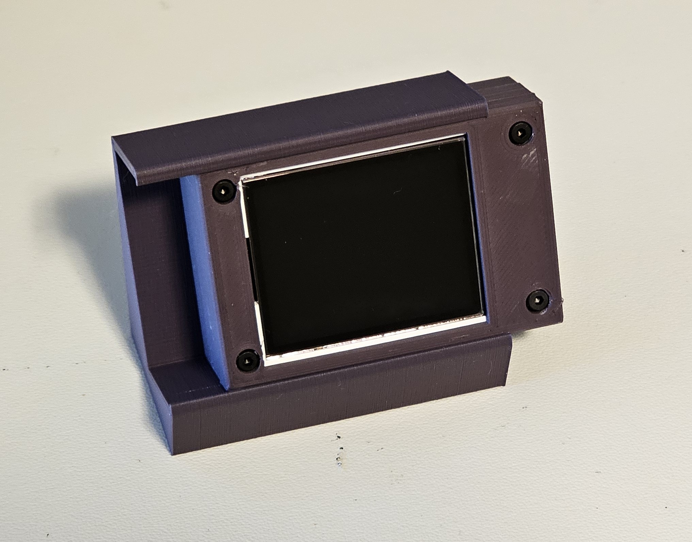

# Enclosure

Three printed parts that sandwich the board and display, held together by four screws
through the stack, plus an optional stand that tilts the finished case back 25 degrees.
Everything is in [`enclosure/`](../enclosure).

There are two builds, one per board (see [hardware.md](hardware.md)). They share the
front, the stand, the fasteners and the outside dimensions. Only the mid and back
parts, which hold the board, are cut for one board or the other.

| Part | Nano ESP32 build | RP2040-Zero build | Footprint | Depth |
|------|------------------|-------------------|-----------|-------|
| Front | `front-v0` | `front-v0` | 40 x 60 mm | 5.0 mm |
| Mid | `mid-v0` | `mid-rp2040-v0` | 40 x 60 mm | 8.0 mm |
| Back | `back-v0` | `back-rp2040-v0` | 40 x 60 mm | 6.0 mm and 9.0 mm |
| 25-degree stand (optional) | `25-degree-stand-v0` | `25-degree-stand-v0` | 38 x 60 mm | 51 mm tall |

Both cases have the same 40 x 60 x 19 mm envelope and take the same screws. The depths
are bounding boxes, and `back-rp2040-v0`'s 9 mm includes ridges that interlock into the
mid part when assembled, so the parts' depths do not add up to the stack.

### Which file to open

Each part ships in three formats. They are not redundant; they serve different jobs.

| Format | What it is | Reach for it to |
|--------|------------|-----------------|
| `.SLDPRT` | SolidWorks 2026 source, with the feature history intact | Edit the design the way it was designed. Needs SolidWorks |
| `.STEP` | Neutral solid geometry, AP214 | Open and modify anywhere: FreeCAD, Fusion, Onshape, Blender. No feature history, so it arrives as a dumb solid |
| `.3MF` | Mesh | Slice and print. This is the one to hand your slicer |

**Print from the 3MF. Modify from the STEP unless you own SolidWorks.** The STEP is
the format that makes this project actually forkable: a dumb solid is still real
geometry you can cut, extend and re-export, which a mesh is not. If you are adapting
the case for a different board, that is where to start.

Stacked depth is 19 mm for either build. The footprint is smaller than the bare display module, which is
56 mm on its long edge, because the panel overhangs its own PCB.

Dimensions above were measured from the mesh bounding boxes in the 3MF files, so they
are the modelled sizes rather than the printed ones. Expect the usual shrinkage and
elephant's foot on the first layer.

## Bill of materials

| Qty | Item | Notes |
|-----|------|-------|
| 1 | Arduino Nano ESP32, **headerless** | Nano build. **ABX00092**, not ABX00083. See below |
| 1 | Waveshare RP2040-Zero, **without headers** | RP2040 build, instead of the Nano. The plain one, not the pre-soldered RP2040-Zero-M. See below |
| 1 | 1.8" TFT, 128x160, ST7735S, 3.3 V, SPI, 8-pin | [JESSINIE listing](https://www.amazon.com/dp/B0D31BGJWF). Expect BGR wiring; see [hardware.md](hardware.md#panel-colour-order) |
| 4 | M2 x 16 socket-head cap screws | Counter-sunk into the stack; see below on length |
| 4 | M2 nuts | |
| 1 | USB-C cable, data and power | Nothing else connects to the outside |
| 8 | 26 AWG **silicone**-insulated hookup wire, stranded tinned copper | Board to display. Sold as "Flexible 26 Gauge Silicone Hook up Wire Kit, Electrical Tinned Copper Wire" |
| 3 | Printed parts | `front-v0`, plus `mid-v0` and `back-v0` for the Nano or `mid-rp2040-v0` and `back-rp2040-v0` for the RP2040-Zero |
| 1 | Printed stand, optional | `25-degree-stand` from `enclosure/`. Nothing fastens it; see below |

## Assembly constraints

The case is tight, and four things follow from that. None of them are preferences.
Everything below is visible in the photo above, which is the Nano build, and applies
to the RP2040-Zero build as well.

**Screw length is quoted under the head.** M2 x 16 means 16 mm of shank; the socket
head adds roughly 2.5 mm on top, for about 18.5 mm overall. Both the head and the nut
are counter-sunk into their parts, so the whole fastener disappears inside the 19 mm
stack with about half a millimetre to spare and nothing protrudes from either face.

Do not size the screw to the 19 mm stack. That convention is the trap: a 19 or 20 mm
screw is too long, not flush.

Socket head rather than hex head, so a driver reaches down into the counterbore
instead of needing side clearance for a wrench.

**The board must have no headers.** For the Nano that means ABX00092, not ABX00083,
which is the same board with pin headers already soldered on. The two are otherwise
identical, so it is an easy thing to order wrong. For the RP2040-Zero it means the plain
board with its loose header strips left in the bag, not the RP2040-Zero-M, which comes
with them soldered. Headers add height the case does not have, and more importantly the
clamshell ridges close onto the bare PCB to retain the board. There is nowhere for a
header strip to go. Wires are soldered straight to the board's pads.

**The display's 8-pin header is bent through 90 degrees** so the panel sits flat against
the front while the connections run back into the cavity. Wires are soldered directly to
those pins. No sockets, no dupont housings; both would add height and neither would
survive the bend.

**Nothing mechanically fastens the boards.** The clamshell ridges hold the Nano or the RP2040-Zero, and
the stack holds itself together through the four screws. That works because everything
inside is thin and nothing pushes back, which is the whole reason the wire specification
matters.

**The wire specification is not incidental, and silicone is the part that matters.**
Bring-up used ordinary breadboard jumper wires. They are PVC-insulated and stiff, they
hold whatever bend you last put in them, and inside a 19 mm cavity that spring-back
pushes the display off its seat and strains the header pins. The lid will not close.

Silicone-insulated wire solves it on four counts:

- **It stays limp.** Silicone has almost no memory, so the wire lies where it is put
  instead of trying to straighten out against the lid.
- **It is finely stranded.** Flexible silicone wire uses many thin strands rather than
  a solid core or a few coarse ones, which is most of where the flexibility comes from.
- **Tinned copper does not fray or tarnish.** The strands stay together when stripped
  and take solder without fuss.
- **It tolerates a soldering iron.** Silicone is good to around 200 C. PVC shrinks back
  from the heat and can leave bare conductor near the joint, which matters most on
  short leads where the iron is close to the insulation. In a sealed metal-free box the
  consequence is not dramatic, but a receded jacket next to a 3.3 V rail is still a
  thing you would rather not build in.

This is a requirement, not a nice-to-have. There is very little spare volume, the board is retained by nothing but the clamshell ridges, and stiff wire pushing back against the lid is enough to lift it out of them. Building this with ordinary PVC hookup wire is doomed, not merely awkward.

Wiring itself is unchanged from bring-up: eight conductors, no passives, no level
shifting. The pinout is in [hardware.md](hardware.md#wiring).

## The 25-degree stand

Optional, and independent of everything above: the case is complete without it. Flat on
the desk the screen points at the ceiling, which is fine if the beacon sits below eye
level and wrong everywhere else. The stand tilts it back 25 degrees so the panel faces
you from a normal seated position.

It is one part: a single profile extruded 60 mm, which is the case's long edge.

**The case is held by friction alone.** The body drops into the slot and stays there;
there are no screws, no clips, and no features on the case that the stand engages. That
follows from the clamshell being finished before the stand existed, and it is the reason
the stand is a separate object rather than a revision of `back`: you can print one, not
print one, or print a different one, without touching a case that already fits.

A friction fit is a tolerance fit, so it is the one thing here that may not transfer
between printers. If yours comes out loose, scale the slot rather than the part.

## Print settings

These are the settings that produced the parts that fit.

| | Clamshell (`front`, `mid`, `back`) | Stand |
|---|---|---|
| Printer | Prusa i3 MK3S | Prusa i3 MK3S |
| Nozzle | 0.4 mm | 0.4 mm |
| Layer height | 0.10 mm, the stock **DETAIL** preset | 0.20 mm, the stock **SPEED** preset |
| Material | PLA | PLA |
| Infill | 20% | 15% |
| Supports | none | none |

**Orientation:** largest flat face down for each part. The geometry makes it obvious;
there is no overhang to argue about, on either the clamshell or the stand.

**0.10 mm is the only layer height the clamshell has been printed at.** It is not known
to be necessary. The parts are small enough that a finer layer costs little time, so
there was never a reason to experiment, and the fit was tuned at this setting. Whether
0.15 or 0.20 mm also fits is simply untested. If you print coarser and something binds,
come back to 0.10 before suspecting the model, since that is the only combination known
to work.

**Infill was not tuned.** The clamshell has only been printed at 20% and the stand only
at 15%. Neither number was chosen; they are what the slicer was already set to. These
are small solid-walled parts with no load path through the infill, so the two are very
unlikely to differ in any way you could measure. Recorded here because it is what was
actually run, not because it is a requirement.

## Two builds

**The Nano ESP32 build** came first because the board was on hand and the display
wiring was already proven on it in `env_monitoring`. It is complete, in daily use, and
the reference the other build is measured against.

**The RP2040-Zero build** exists because the Nano is overkill here. Its Wi-Fi and
Bluetooth are most of what it costs, and this project uses neither: everything travels
over USB by design, and [not adding a network](architecture.md#non-goals-for-now) is a
deliberate choice rather than an unfinished one. A Waveshare RP2040-Zero is far smaller
and cheaper, has USB-C, and is 3.3 V logic, so the display still needs no level
shifting.

What differs between them:

- **Mid and back parts.** The ridges that retain the board are shaped to its outline,
  so each board has its own pair. The front, the stand, the screws and the outside
  dimensions are shared.
- **Wiring.** Same eight display wires, different pads on the board. See
  [hardware.md](hardware.md#wiring).
- **Firmware.** Pins, the SPI bus and some USB serial details are board-specific. The
  host daemon is the same for both.

Status: the RP2040-Zero build is assembled and running the same firmware as the Nano,
from the same source. What is left is a day of living with it and a photo of the
finished unit, tracked on the [roadmap](roadmap.md#next-rp2040-zero-edition).

## Versioning

Every part is suffixed `-v0`, the stand included. That is the revision that was fitted
and works. A part cut for one board carries the board in its name before the version,
as in `mid-rp2040-v0`; a part without one, like `front-v0`, is shared by both builds,
and the Nano's own parts keep the plain names they had before there was a second build. If a part is revised, add `-v1` rather than overwriting, and revise all three
formats together so they cannot drift apart.

The reason for keeping old versions rather than relying on history: none of these
formats diff usefully. SolidWorks parts are binary containers, and while STEP is
technically a text format, a diff of a few thousand renumbered geometry entities tells
you nothing. Git can store all of them faithfully; it just cannot tell you what
changed. An old file sitting next to the new one is the only practical way to compare
or fall back.
